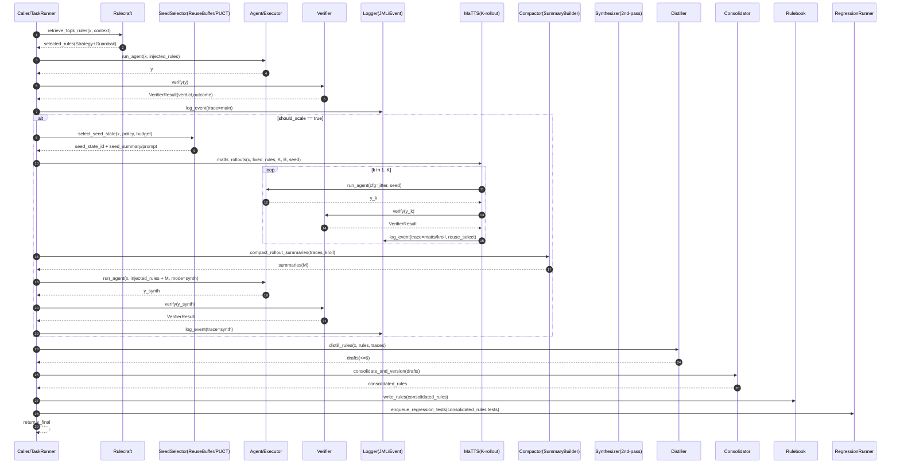

# Rulecraft v0.5.15 Addendum — Strategy Memory Loop(ReasoningBank) + MaTTS + PaCoRe-lite(병렬-압축-합성 TTC) + SandboxLoop(LLM-in-Sandbox) 이식 (Debias + K-rollout 포함)

문서 리비전: **rev15**  
작성일: 2026-01-23 (Asia/Seoul)


수정일: 2026-01-29 (Asia/Seoul)
패치: TongGeometry(GTS) — LLM 가이드 트리 서치(형식-검증 도메인) 이식
패치: NN-FT(2601.14453) — FlowMap Neural Field Estimator(옵션)
패치: LongCat-Flash-Thinking-2601 이식(HeavyThinking + 노이즈/환경 스케일링)
패치: Phase 2 — Folding + Memory Actions (운영 자동화)
패치: Phase 3 — PRAXIS: ReuseBuffer 조건부 전술 저장소 확장
패치: hotfix09(원천) — InFi-Check FGFC(근거/오류타입/교정) 확장(VerifierResult.fgfc) + 관련 참조 갱신
패치: hotfix12 — Patterning(dual of interpretability) 기반 데이터 개입(오프라인) 이식
패치: hotfix12p1 — Verifier/Router 무(無)모델 기본값 + 에스컬레이션 지표/트리거(관측 가능성) 추가

> 기준 문서: Rulecraft 설계 문서 v0.5.10
> 관련 문서: `Rulecraft_Playbook_r15_memory_phase3_longcat2601_hotfix12p1.md` (Runner/Policy/Rulebook 운영 플레이북)
> - Contracts/Schema SSOT: `Rulecraft_SSOT_0.5.15_ssot07_memory_phase3_hotfix12p1.md`
> - Verifier 제작 사양: `Rulecraft_Verifier_Spec_r06_memory_phase3_longcat2601_hotfix12p1.md`
> 추가(선택): Offline FlowMap Analyzer(RiskMap/OpportunityMap) — 로그 기반 정책 신호(ADR-0014)
> 선행 부록: v0.5.11 Addendum (Debias + K-rollout Pass Estimator), v0.5.12 Addendum (ReasoningBank + MaTTS 합류), v0.5.13 Addendum (SSOT + ADR)
> 참고 논문: arXiv:2509.25140 **ReasoningBank: Scaling Agent Self-Evolving with Reasoning Memory** (2025-09-29)
> 참고 논문: arXiv:2601.05593 **PaCoRe: Learning to Scale Test-Time Compute with Parallel Coordinated Reasoning**
> 참고 논문: arXiv:2601.13548 **Patterning: The Dual of Interpretability** (susceptibility 기반 데이터 개입)
> 참고 논문: arXiv:2601.14453 **Universality of Neural Network Field Theory** (2026-01-22)
> 참고 논문: arXiv:2601.14525 **Towards Execution-Grounded Automated AI Research** (Execution-guided evolutionary search 관찰)
> 참고 논문: arXiv:2601.16206 **LLM-in-Sandbox Elicits General Agentic Intelligence** (General-purpose code sandbox + non-agentic RL)
> 참고 논문: arXiv:2507.21184v5 **Can Language Models Discover Scaling Laws?** (Execution-grounded program evolution + MAP-Elites식 다양성 관리 관점)
> 참고 논문: arXiv:2601.16725 **LongCat-Flash-Thinking-2601 Technical Report** (환경 스케일링 + 노이즈 분해 + Heavy Thinking TTC)

이 부록은 v0.5.10의 큰 구조(Data/Control plane, Verifier/Router/Meta-controller, Utility-Q, Coverage/Regression)를 바꾸지 않고,
- v0.5.11에서 도입한 **Debias + K-rollout pass 확률 추정**을 유지하면서
- ReasoningBank가 제안하는 **전략 메모리 증류-검색-재증류(Strategy Memory Loop)**와
- MaTTS(memory-aware test-time scaling)의 **경험 증식(contrastive rollouts)**을
- PaCoRe가 제안하는 **병렬 탐색 → 메시지 압축(compaction) → 합성(synthesis)** 라운드 패턴을
  Rulecraft의 K-rollout/MaTTS 루프 위에 최소 비용으로 얹어, 병렬 결과를 실제 답변에 “먹이도록” 만든다.
즉, 위 3가지를 Rulecraft 운영 커널에 **가성비 중심으로** 이식한다.

추가로 v0.5.14에서 "글로는 있는데 구현자가 흔들리는 부분"을 줄이기 위해 아래 5가지를 문서에 직접 반영했다.
1) **Contracts/Schema SSOT(단일 진실원천)**
2) **규범 키워드(MUST/SHOULD/MAY)**
3) **런타임 플로우 1장(시퀀스 다이어그램)**
4) **ADR(설계 결정 기록) 인덱스**
5) **PaCoRe-lite Synthesis Pass(라운드 합성) SSOT**

추가로 v0.5.15에서는 아래 9가지를 더 반영한다(운영 예산 누수/정합성 구멍 봉합 목적).
1) **Debias deadzone cap + frontier band-pass(개선 불능군 과몰입 방지)**
2) **Uncertainty/Disagreement 기반 2단계 스케일링(probe→full) 트리거 규격화**
3) **VerifierResult 구조화(reason_codes, violated_constraints)로 증류 신호 강화**
3a) **(VerifierResult/FGFC) InFi-Check식 FGFC(근거+오류타입+교정) 확장(`VerifierResult.fgfc`)로 디버깅/교정/반례 생성을 직결** (§3.3)
4) **counterexample_tests 최소 생성 규격 + 승격(temporary→active) 조건 강화**
5) **비용(cost) 피드백으로 K/synth 예산 자동 제어(버킷×impact별 비용 프로파일)**
6) **Micro-Regression(팩 기반) + counterexample 규율을 Rulebook 승격 게이트에 반영**
7) **Distiller/Consolidator에 “설명→실패예측→반례 생성” 루틴을 출력 규격 + 승격 조건으로 고정**
8) **Execution-Grounded Policy Search(옵션)**: 실행 결과 기반으로 룰/정책 패치를 탐색(§8.3, ADR-0015)
9) **mode collapse 방지 규율**: novelty quota + ROBUSTNESS(transform) + consistency 점수화(ADR-0016)

---

## 문서 상태
- 본 문서에서 **MUST/SHOULD/MAY**로 표기된 문장은 *규범(Normative)* 이다.
- 그 외 설명/예시/권장값은 *정보(Informative)* 이다.
- 본 문서의 계약/스키마(§3)는 SSOT의 **핵심 발췌/요약본**이다. 정본은 `Rulecraft_SSOT_0.5.15_ssot07_memory_phase3_hotfix12p1.md`이며, 불일치가 생기면 **SSOT 파일을 먼저 수정**한 뒤 필요 시 본 문서를 동기화한다.


> 운영 관점에서 “지금 당장 구현 순서”는 Playbook r15 §1.1(실용 응용 이식안 요약)에 따로 요약되어 있다.
> 본 Addendum은 계약/스키마(SSOT)와 루프 규율을 고정하는 문서다.


### (재검토 반영) 통합 순서 가이드(현실 버전)
이 부록은 기능 목록이 많아 보이지만, 운영에서 망하지 않으려면 **순서**를 고정해야 한다.

0) **SSOT(계약) 잠금**: `schema_version`, id 유일성, PASS 정의(SSOT §5.1) 고정  
1) **MVP 루프**: `Runner + LLMAdapter + Verifier + Logger(EventLog/Trace)`가 항상 끝까지 돈다  
2) **Verifier 실체화**: L1(정적) 필수 → 가능하면 L3(실행)로 outcome 확정  
3) **should_scale = 계산 상한 장치**: 상시 K/synth 금지, 트리거 기반만  
4) **PaCoRe-lite**: rollout→summary→top-m→synth(2-pass) + 재검증 + fallback  
5) **BudgetRouter**: bucket×impact 비용 프로파일로 K/synth/max_tokens 상한 제어  
6) **Rulebook 승격 게이트**: tests/counterexample 없는 룰은 temporary 유지  
7) **FlowMap/PolicySearch**: 로그가 쌓인 뒤에만(Replay→Canary→Rollback 규범 준수)
8) **Patterning(데이터 개입) 루프(옵션)**: χ(민감도)로 “어떤 데이터 슬라이스를 얼마나 섞을지”를 역으로 계산해 Distiller/회귀 데이터 믹싱에 반영


---

## 0) 용어 주의 (SSOT vs SoT)

- **SSOT**: *Single Source of Truth*. “계약/스키마/정의의 단일 진실원천”을 의미한다(본 문서 §3).
- **SoT**: *Society-of-Thought*. 대화적 추론 스캐폴딩(역할 분화, 질문/반박/통합)을 의미한다(본 문서 §5.4.2).
- 약어가 비슷하지만 목적이 다르다. SSOT는 “정의의 고정”, SoT는 “추론 절차”다.

## 1) Normative Keywords (RFC 2119 스타일)
- **MUST**: 반드시 지켜야 한다. 위반 시 시스템의 정합성/안전/재현성이 깨질 수 있다.
- **MUST NOT**: 금지.
- **SHOULD**: 강하게 권장한다. 환경/예산/목표에 따라 예외가 가능하지만, 예외를 선택할 땐 근거를 남긴다.
- **MAY**: 선택 사항.

---

## 2) 왜 이걸 넣나 (한 줄 요약)
RFT/0–1 보상 RL 계열은 업데이트가 “이미 잘 맞추는(쉬운) 케이스”에 더 쏠리는 편향이 생기기 쉽다.
Rulecraft는 원래 “커버리지/하드케이스/고영향 방어”가 목적이므로, **샘플링·선택·회귀에서 쉬운 케이스 편향을 구조적으로 줄이고**,
`utility_q_ema`를 **단발 샘플이 아니라 K-rollout 기반 pass 확률 추정**으로 안정화한다.

---

## 3) Contracts & Schemas (SSOT 발췌본)

### 3.0 공통 규칙
- 모든 레코드는 `schema_version`(문자열)을 **MUST** 포함한다.
- 모든 ID는 안정적 식별자이며, `*_id`는 **MUST** 전역 유일(충돌 없음)해야 한다.
- `verdict == PASS` 이더라도 `outcome == FAIL`이면 pass가 아니다(§5.1의 pass 정의를 따른다).
- `bucket_key`는 최소한 `impact_level × domain_tag × user_clarity`로 구성되는 문자열을 **SHOULD** 포함한다.

> 아래 형태는 구현 언어/스토리지와 무관한 “계약 형태”이다.
> 실제 JSON Schema로 분리할 경우 필드명·의미는 동일해야 한다.


### 3.0.1 Memory Subsystem 계약 (Phase 0/1/2)

Rulecraft의 “메모리”는 실행 기반 재사용/학습을 위한 **데이터 계약**이다.

- 저장소: **EventLog / TraceCapsule**
- 작업 메모리: **WorkingSet** (현재 task fold 전)
- 장기 메모리: **ReasoningBank** (에피소드/전술) + **Rulebook** (승격 룰)
- 캐시: **ReuseBuffer** (seed/prior)
- 오퍼레이션: **WRITE / PIN / MERGE / PRUNE / RETIRE / RECALL(intent,state)**

#### intent_key / state_key (Phase 1)

- **intent_key (안정)**: “무슨 종류의 일을 하려는가” (domain/task/tools/output/constraint 기반)
- **state_key (휘발)**: “지금 어떤 실행 상태인가” (run.mode/budget/policy/tool/sandbox/verifier 프로필 기반)

#### RECALL 규율(Phase 1): STITCH-style filter → rerank

1) 소스별 후보 수집(ReasoningBank/Rulebook/ReuseBuffer/최근 TraceCapsule)  
2) 호환성 필터(bucket/intent/state 컷)  
3) rerank: `semantic + intent + state + quality` 가중합  
4) top-m을 MemoryHint로 반환하고, 실제 사용은 EventLog에 기록한다.

> 주입 예산: MemoryHint/ConditionalTactic의 길이 상한은 SSOT §4.4.1을 따른다. Runner는 이 상한을 **반드시** 강제해야 한다(가벼운 메모리 유지).


### 3.0.2 Folding + Memory Actions (Phase 2)

Phase 2의 목적은 Phase 0/1에서 정의한 메모리 계약을 “운영 자동화”까지 닫아,
런이 끝날 때(또는 중간 트리거 발생 시) **WorkingSet/Trace를 재사용 단위로 접고(Folding)**,
필요한 메모리 오퍼레이션을 **계획(Plan)→적용(Apply)→기록(Record)** 하는 것이다.

#### Folding 트리거(권장)

- `end_of_run` (기본)
- `ws_overflow` (WorkingSet이 과대해져 컨텍스트 압력이 커질 때)
- `fail_cluster` (유사한 `violated_constraints` 또는 `reason_codes`가 반복될 때)
- `phase_shift` (probe→full 등 모드 전환)
- `manual` (테스트 하네스/운영자 강제)

Folding 산출물은 SSOT의 `FoldResult`로 기록하고, EventLog에서 참조 가능해야 한다.

#### Memory Actions Planner (권장)

Planner 입력 신호(최소):
- `EventLog.memory_recall.used_ids` (무엇을 실제로 썼는지)
- `VerifierResult.reason_codes / violated_constraints` (실패 패턴/상태 신호)
- 비용/예산 프로파일(있다면): cost_profile, budget_tier 등

Planner 출력:
- `MemoryActionPlan` (WRITE/PIN/MERGE/PRUNE/RETIRE 실행 계획)
- Executor 적용 결과는 `MemoryActionRecord`로 남긴다.

#### 안전장치(필수)

- Rulebook은 **승격 룰 저장소**다. Phase 2 자동화는 Rulebook에 **draft/temporary 후보**를 만들 수는 있어도,
  `active` 승격은 tests/게이트를 통과한 별도 루프에서만 수행한다.
- PRUNE는 PIN/보존 대상(최소 TTL 포함)을 제외한다. 기본은 RETIRE 우선.
- Phase 2의 모든 결과(FoldResult/Plan/Record)는 EventLog의 `memory_fold` / `memory_actions`에서 추적 가능해야 한다.

### 3.0.3 PRAXIS: ReuseBuffer를 ‘조건부 전술 저장소’로 확장 (Phase 3)

Phase 3은 ReuseBuffer를 단순 “seed/prior 캐시”에서 확장해, **조건부 전술(conditional tactics)** 을 저장/리콜/갱신하는 운영 루프를 추가한다.

- 저장 단위: `ConditionalTacticRecord`
  - “언제 쓰나”: `(bucket_key, intent_key, state_key, predicates)`
  - “무엇을 쓰나”: 짧은 전술/체크리스트/절차(`injection.content`)
  - “왜 믿나”: 근거(trace/verifier) + 효율 지표(pass 추정/비용)
- 저장 위치: `ReuseBuffer.tactic_entries`
- 사용 경로:
  1) **RECALL**: Phase 1 `RECALL(intent,state)`에서 소스 `ReuseBuffer`(tactic_entries)로 후보를 모아 filter→rerank 후 top-m 반환
  2) **UPDATE**: Phase 2 Folding/Memory Actions 끝에서 `MemoryActionPlan`에 따라 `WRITE/MERGE/RETIRE/PIN`으로 전술을 기록/갱신
- 안전 규율(필수):
  - Conditional tactics는 **Rulebook 룰이 아니다**(승격/강제 적용 금지).
  - “과주입”은 컨텍스트/정합성 누수의 주요 원인이므로, 길이 제한/우선순위/충돌 규율을 Playbook에서 고정한다.
  - 나쁜 전술의 확산을 막기 위해, 실패/충돌 시 `RETIRE` 우선 + canary/replay로만 정책 반영한다.

### 3.1 RuleRecord (룰 저장 단위)
```yaml
RuleRecord:
  schema_version: "0.5.15"
  rule_id: string               # MUST
  version: string               # MUST (예: semver 또는 내부 버전)
  type: "StrategyRule" | "GuardrailRule"     # MUST
  status: "temporary" | "active" | "retired" # MUST

  title: string                 # SHOULD
  body: string                  # MUST (룰의 실제 텍스트/절차/금지사항)

  applicability:                # MUST
    domain_tag: string          # SHOULD
    task_family: string         # SHOULD
    predicates:                 # MAY (간단 규칙식 / feature predicate)
      - string
    bucket_keys:                # MAY (명시적 버킷 타겟)
      - string

  priority:                     # SHOULD (주입/적용 순서)
    guardrail_first: bool       # MUST (GuardrailRule이면 true 권장)
    rank: int                   # MAY

  evidence:                     # MUST (근거 링크)
    trace_ids: [string]         # SHOULD
    verifier_ids: [string]      # MAY
    regression_ids: [string]    # MAY

  tests:                        # MUST
    regression_tests: [string]        # MUST (없으면 empty)
    counterexample_tests: [string]    # MUST (없으면 empty)

  metrics:                      # MUST
    utility_q_ema: float               # SHOULD
    pass_p_hat: float | null           # SHOULD
    pass_p_lb95: float | null          # SHOULD
    pass_p_K: int | null               # SHOULD
    pass_p_bucket:                    # MAY
      "<bucket_key>":
        p_hat: float
        p_lb95: float
        K: int


    pass_p_bucket_delta:               # MAY (룰 적용 전후 변화 추정; replay/canary에서 갱신)
      "<bucket_key>":
        delta_p_hat: float|null
        delta_p_lb95: float|null
        delta_K: int|null
  lifecycle:                    # MAY
    created_at: string
    updated_at: string
    last_used_at: string
    retire_candidate: bool
```

#### RuleRecord 규범
- `type`과 `status`는 **MUST** 명시한다.
- `tests.regression_tests`가 비어있으면 `status`는 **MUST** `temporary`여야 한다.
- `GuardrailRule`은 주입/적용에서 **MUST** StrategyRule보다 먼저 고려되어야 한다(§6.2).

---

### 3.2 CandidateSelect (룰 선택 계약)
```yaml
CandidateSelectRequest:
  schema_version: "0.5.15"
  request_id: string        # MUST
  x_ref: string             # MUST (입력/태스크 식별자 또는 해시)
  bucket_key: string        # SHOULD
  context:
    impact_level: "low"|"med"|"high"   # SHOULD
    domain_tag: string                   # SHOULD
    user_clarity: "low"|"med"|"high"  # SHOULD
  constraints:
    max_rules: int          # MUST
    allow_types: ["StrategyRule","GuardrailRule"]  # MUST
    prompt_profile: string  # SHOULD

CandidateSelectResponse:
  schema_version: "0.5.15"
  request_id: string        # MUST
  selected_rules:           # MUST
    - rule_id: string
      version: string
      type: "StrategyRule"|"GuardrailRule"
      injection_mode: "prepend"|"inline"|"system_guard"  # MUST
      score: float          # SHOULD
      reasons: [string]     # MAY
  exploration:
    used_debias: bool       # SHOULD
    debias_weight: float|null
    used_novelty: bool|null     # MAY (mode collapse 방지용 탐색 신호)
    novelty_weight: float|null  # MAY (보상/선택에서 novelty 가중치)
    diversity_score: float|null # MAY (집단 내 유사도↓일수록↑ 같은 얕은 지표)
```

#### CandidateSelect 규범
- 응답은 `selected_rules`를 **MUST** 포함한다(비어있을 수는 있으나 명시해야 한다).
- GuardrailRule이 선택되면 `injection_mode`는 **SHOULD** `system_guard` 또는 이에 준하는 우선 모드여야 한다.

- `selected_rules[].reasons`는 선택 근거를 짧은 태그/문장으로 남긴다(**MAY**, 운영상 강력 추천).
  - FlowMap 기반 운영 시 권장 태그:
    - `risk_hotspot=<stage|edge>[:<reason_code>]` (예: `risk_hotspot=main→verify:format_leak`)
    - `opp_hotspot=<intervention>` (예: `opp_hotspot=K_probe→K_full+synth`)
    - (선택) `reuse_seed=<state_id>` (예: `reuse_seed=rs_01H...`)  # ReuseBuffer seed 사용 시
    - (선택) `efficiency=<gain/cost>` (정확 수치가 아니어도 됨)

- `exploration.diversity_score`는 선택된 룰 집합의 **표현 다양성** 지표다(**MAY**, 권장).
  - 권장 계산(embedding 사용 시): `diversity = 1 - mean_{i<j}(cos_sim(e_i, e_j))` (0~1)
  - embedding이 없으면 타입/버킷 분산 같은 얕은 대체 지표로도 된다.

---

### 3.3 VerifierResult (검증 계약)
```yaml
VerifierResult:
  schema_version: "0.5.15"
  verifier_id: string       # MUST
  verdict: "PASS"|"FAIL"|"PARTIAL"   # MUST
  outcome: "OK"|"FAIL"|"UNKNOWN"      # MUST
  score: float|null             # SHOULD (0~1, 선별/스케일링에 쓰는 주 점수)
  score_method: "yes_logit"|"pairwise_rank"|"rule_check"|"hybrid"|null  # MAY
  score_evidence: object|null   # MAY (예: {yes_logit:float, confidence:float})
  failure_cluster_id: string|null       # MAY
  notes: string|null        # MAY
  reason_codes: [string]|null          # SHOULD (FAIL/PARTIAL 시 최소 1개 권장)
  violated_constraints: [string]|null  # MAY (정적 규칙/제약 위반 목록)
  fgfc: object|null   # MAY (Fine-Grained Fact Checking payload; SSOT의 FGFCReport)
  scores:                   # MAY
    holdout_score: float|null
    safety_score: float|null
```


#### (옵션) FGFC 확장 — 세부 팩트체크(근거/오류타입/교정)

- 도큐먼트 기반 답변(요약/리포트/인용 포함)에서는 Verifier가 `VerifierResult.fgfc`를 채워서:
  - **문장(또는 atomic claim) 단위 verdict**
  - **오류 타입(error_type)**
  - **근거(evidence)**
  - **교정안(correction)**
  를 구조화해 남긴다(SSOT의 `FGFCReport` 참조).
- 이 신호는 다음 단계에서 바로 쓰인다:
  - `counterexample_tests` 자동 생성(타입 지정 반례)
  - Distiller의 “실패 패턴 → 패치 후보 룰” 증류
  - FlowMap에서 fail cluster 원인 분해(팩트 오류 vs 툴/환경 노이즈)


#### Verifier 규범
- Verifier는 `verdict`와 `outcome`을 **MUST** 반환한다.
- `verdict in {FAIL, PARTIAL}` 또는 `outcome in {FAIL, UNKNOWN}`인 경우, Verifier는 원인 식별을 위해 `reason_codes`를 **SHOULD** 반환한다(가능하면 1개 이상).
- Verifier가 규칙/제약 위반을 판별할 수 있으면 `violated_constraints`를 **SHOULD** 반환한다(없으면 null 허용).
- pass 판정은 §5.1의 규칙을 **MUST** 따른다.

#### 무(無)모델 우선 원칙 + 에스컬레이션(필요 시) 지표

- Rulecraft의 기본 목표는 **Verifier/Router를 별도 AI 모델 없이** 먼저 구현하는 것이다.
  - Verifier: L1 정적 검증(필수) + 가능하면 L3 실행 검증으로 `outcome`을 확정
  - Router/BudgetRouter: EventLog/VerifierResult/cost 집계 기반의 결정적 정책
- “모델을 붙일지”는 감이 아니라 관측치로 결정한다(SSOT §5.4, Verifier Spec §0.1).
  - `unknown_rate`가 높아도, 그 원인이 `exec_unavailable_rate`라면 “L2 붙이기”보다 L3(하네스/샌드박스) 확보가 먼저다.
  - 반대로 `insufficient_evidence_rate`가 높고 L3로 확정이 불가능한 텍스트 태스크가 병목이면, 그때만 제한적으로 L2(저비용 grader)를 검토한다.


---

### 3.4 EventLog / Trace (실행 로그 계약)
```yaml
EventLog:
  schema_version: "0.5.15"
  trace_id: string          # MUST
  x_ref: string             # MUST
  bucket_key: string        # SHOULD

  flow_tags: [string]|null     # MAY (예: planner-heavy, tool-heavy, verifier-heavy)
  policy_signals:              # MAY (FlowMap/Policy 입력 투명화)
    risk_score: float|null
    opp_score: float|null
    efficiency: float|null

  selected_rules:              # MUST (CandidateSelectResponse의 일부 미러)
    - rule_id: string
      version: string
      type: string

  # (옵션) 실행-기반 평가/탐색 컨텍스트(Execution-grounded loop)
  experiment:                  # MAY
    kind: "policy_search"|"execution_eval"|"rule_evolve"|"scaling_law"|null
    harness_id: string|null
    idea_id: string|null
    search_epoch: int|null
    population_id: string|null
    parent_ids: [string]|null
    mutation_ops: [string]|null
    exec_ok: bool|null
    exec_failure_class: string|null
    reward:                    # MAY
      total: float|null
      pass: float|null
      cost: float|null
      diversity: float|null
      consistency: float|null

  # (옵션) ReuseBuffer에서 seed를 선택해 롤아웃/탐색을 '재시드'한 경우의 선택 메타데이터
  reuse_select:                        # MAY
    enabled: bool|null                 # MAY
    policy: string|null                # MAY (예: "puct_maxq_rankprior_v1")
    selected_state_id: string|null     # MAY
    selected_score: float|null         # MAY (PUCT score)
    puct:                              # MAY
      c: float|null                    # MAY (exploration constant)
      Q_method: "max_reward"|"mean_reward"|null   # MAY
      P_method: "rank_prior"|"uniform"|null       # MAY
      Q: float|null                    # MAY (selected state's Q)
      P: float|null                    # MAY (selected state's P)
      T_total: int|null                # MAY (총 선택 횟수)
      N: int|null                      # MAY (selected state's 선택 횟수)


  # (옵션) Phase3 PRAXIS 조건부 전술 리콜/사용 메타데이터
  praxis:                              # MAY
    enabled: bool|null                 # MAY
    policy: string|null                # MAY (예: "praxis_conditional_tactics_v1")
    retrieved_tactic_ids: [string]|null # MAY (top-k 후보)
    used_tactic_ids: [string]|null      # MAY (실제로 주입/참조한 전술)
    top_scores: [float]|null            # MAY (retrieved와 동일 순서)
    notes: string|null                  # MAY (failover, override 등)


  # (옵션) Phase1 메모리 RECALL 메타데이터 (intent/state 기반)
  memory_recall:                      # MAY
    enabled: bool|null                # MAY
    method: string|null               # MAY (예: "intent_state_recall_v1")
    intent_key: string|null           # MAY
    state_key: string|null            # MAY
    sources: [string]|null            # MAY (예: ["ReasoningBank","Rulebook","ReuseBuffer","TraceCapsule"])
    retrieved_ids: [string]|null      # MAY (top-k 후보)
    used_ids: [string]|null           # MAY (실제로 주입/참조한 항목)
    top_scores: [float]|null          # MAY (retrieved_ids와 동일 순서)
    notes: string|null                # MAY (failover, override 등)

  run:
    mode: "main"|"sot"|"matts"|"kroll"|"synth"    # MUST
    cfg:                               # MAY (jitter, seed 등)
      seed_prompt: string|null
      tool_order: string|null
      temperature: float|null
      plan_style: string|null
      self_refine_steps: int|null

  sandbox:                              # MAY (LLM-in-Sandbox)
    enabled: bool|null
    image_id: string|null               # 예: docker image digest/tag
    network: "off"|"allowlist"|"on"|null
    allowlist: [string]|null
    turns: int|null                     # sandbox interaction turns
    actions_n: int|null                 # tool actions (bash/edit)
    files_read_n: int|null
    files_written_n: int|null
    external_fetch_n: int|null          # network fetch count (if any)
    exec_fail_n: int|null
    traces_ref: [string]|null           # SandboxActionTrace ids (separate store)

  sot_profile: string|null           # MAY (예: "sot_mini_v1")
  sot_max_turns: int|null            # MAY (예: 2~3)

  outputs:
    y_ref: string|null                   # SHOULD (결과 참조)
    rollout_summary: RolloutSummary|null # SHOULD (kroll/matts에서 요약 메시지)
    sot_signals: object|null             # SHOULD (sot에서 대화 행동 신호: qa/shift/conflict/reconcile 등)
    synth_inputs:                        # MAY (synth에서 사용한 메시지 참조)
      used_trace_ids: [string]|null
      used_summary_ids: [string]|null

  verifier:                             # MUST
    verifier_id: string
    verdict: string
    outcome: string

  cost:                                 # SHOULD
    latency_ms: int|null
    tokens_in: int|null
    tokens_out: int|null
    tool_calls: int|null

  rollout_select:                        # MAY (K-rollout 결과 선별 메타; 요약 공간 TTS)
    rollouts_n: int|null                 # MAY (생성된 rollout 수)
    top_m: int|null                      # MAY (synth 입력으로 선택된 요약 수)
    selection_method: string|null        # MAY (예: "score+diversity")
    selected_summary_ids: [string]|null  # MAY
    diversity_score: float|null          # MAY (선별된 집합 기준)

  repr:                                  # MAY (Representation Space 캐시 참조)
    encoder_id: string|null
    dim: int|null
    x_vec_id: string|null
    y0_vec_id: string|null
    summary_vec_ids: [string]|null
```

---

### 3.5 DistillDraft (증류 산출물 계약)
```yaml
DistillDraft:
  schema_version: "0.5.15"
  draft_id: string              # MUST
  source_trace_ids: [string]    # MUST
  proposed_rule:                # MUST (RuleRecord의 부분집합)
    type: "StrategyRule"|"GuardrailRule"
    title: string
    body: string
    applicability: object
  evidence: object              # MUST

  # v0.5.15-addendum(rev03, 이전) 강화: “설명→실패예측→반례”를 Distiller 산출물 규격으로 포함(승격 게이트에서 사용)
  failure_prediction:           # SHOULD (승격 후보라면 사실상 REQUIRED)
    mechanism: string           # SHOULD  (작동 가설: 왜 먹히는가)
    dependencies: [string]      # SHOULD  (의존성: tool/router/format/memory 등)
    predicted_failures:         # SHOULD  (최소 2개 권장)
      - id: string              # taxonomy id (예: context_dilution, instruction_conflict...)
        description: string
        triggers: [string]
        severity: "low"|"med"|"high"

  # v0.5.15-addendum(rev03, 이전) 강화: Micro-Regression 팩 선택(테스트 자동 생성용)
  micro_regression_packs: [string]  # MAY (예: ["FORMAT","TOOL","BUDGET"])

  tests:                        # MUST
    regression_tests: [string]        # SHOULD (micro-regression 포함 권장)
    counterexample_tests: [string]    # SHOULD (>=2: cluster 1 + boundary 1 권장)

```

---

### 3.6 RegressionTestSpec (회귀/반례 테스트 계약)
```yaml
RegressionTestSpec:
  schema_version: "0.5.15"
  test_id: string                 # MUST
  test_type: "regression"|"counterexample"   # MUST
  severity: "critical"|"normal"              # SHOULD

  # 입력 참조: 기존 x_ref 유지(SSOT). 필요 시 prompt를 inline으로 둘 수도 있음(옵션).
  x_ref: string                   # MUST
  prompt: string|null             # MAY (포터블/오픈소스 배포용으로 inline 제공 가능)

  # v0.5.15-addendum(rev03, 이전) 강화: Micro-Regression 자동 채점을 위한 assertion(가능한 경우)
  assert:                         # MAY
    type: "json_schema"|"regex_present"|"regex_absent"|"tool_called"|"tool_not_called"|"length_lte"|"exact_match"|"contains"
    args: object

  # v0.5.15-addendum(rev03, 이전) 강화: 반례는 최소한 cluster/boundary를 구분하면 운영이 편해짐
  kind: "cluster"|"boundary"|"transform"|null   # MAY

  tags: [string]|null            # MAY (예: ["context_dilution","format_leak"])
  expected:
    must_pass: bool               # MUST
    notes: string|null            # MAY
  linked_rule_ids: [string]       # SHOULD
```

---
### 3.7 RolloutSummary (PaCoRe-lite 메시지 압축 산출물 계약)
```yaml
RolloutSummary:
  schema_version: "0.5.15"
  summary_id: string            # MUST
  trace_id: string              # MUST (요약이 생성된 실행 trace)

  answer: string                # MUST (한 줄 답 후보)
  key_reasoning:                # MUST (핵심 근거 1~3줄)
    - string
  assumptions:                  # SHOULD (가정/해석 포인트)
    - string
  checks:                       # SHOULD (반례/엣지/검증 포인트)
    - string
  confidence: float             # SHOULD (0~1)

  verifier_score: float|null     # MAY (VerifierResult.score 미러)
  selection_score: float|null    # MAY (top-m 선택 점수: score+diversity-penalty)
  repr:                          # MAY (RepSpace 참조; 요약 공간 TTS용)
    encoder_id: string|null
    dim: int|null
    summary_vec_id: string|null

  verifier_mirror:              # SHOULD (요약 생성 시점의 검증 요약)
    verdict: "PASS"|"FAIL"|"PARTIAL"
    outcome: "OK"|"FAIL"|"UNKNOWN"

  compaction_policy:            # SHOULD
    max_tokens: int|null        # SHOULD (요약 상한)
    forbid_cot: bool            # MUST (true 권장)
    format: string|null         # MAY (template id)
```

#### RolloutSummary 규범
- `answer`는 **MUST** “최종 답 후보”만 담고, 중간 CoT를 길게 포함하는 것을 **MUST NOT** 한다.
- `key_reasoning`은 최대 3개 항목을 **SHOULD** 넘기지 않는다(컨텍스트 비용 고정).
- `forbid_cot`는 기본값 true를 **MUST** 권장한다(메시지 패싱은 결론 압축이 핵심).

---

### 3.8 FlowMapSnapshot (오프라인 지도 산출물 계약)
FlowMapSnapshot은 런타임 산출물이 아니라, `EventLog/VerifierResult/cost`를 일정 창(window)으로 모아 만든 **오프라인 정책 신호**다.
런타임에서는 (선택적으로) `policy_signals`로 일부 값을 미러링할 수 있다(§3.4).

```yaml
FlowMapSnapshot:
  schema_version: "0.5.15"
  generated_at: string                 # MUST
  window:
    start_at: string                   # MUST
    end_at: string                     # MUST
  bucket_key: string                   # MUST

  estimator:                           # MAY
    kind: string                        # 예: "aggregate_v1" | "nn_field_v1"
    model_ref: string|null              # MAY (아티팩트 id/path/hash)
    feature_set: string|null            # MAY (입력 피처 세트 id)
    calibration: string|null            # MAY (보정/캘리브레이션 메모)

  risk:                                # MUST
    stage_hotspots:                    # SHOULD (상위 K개)
      - stage: string                  # 예: main→verify, synth→verify
        reason_code: string|null       # 예: format_leak, tool_misroute
        risk_rate: float               # (verdict∈{FAIL,PARTIAL} OR outcome∈{FAIL,UNKNOWN}) 비율
        support_n: int                 # 표본 수

  opportunity:                         # MUST
    interventions:                     # SHOULD
      - intervention: string           # 예: SoT-1pass, K_probe, K_full+synth
        gain_pass: float               # 개입 전후 PASS 회복(또는 품질 상승) 추정
        delta_cost: float              # 추가 비용(토큰/지연/툴콜 등) 추정
        efficiency: float              # gain_pass / max(delta_cost, ε)
        support_n: int

  notes: string|null                   # MAY
```

#### FlowMapSnapshot 규범
- FlowMap은 **상관 기반 지도**이므로, 정책 반영은 **replay → canary → rollback** 순서로만 수행한다(Playbook §15.6).
- `RiskMap`은 hardcase 플래그/Guardrail 우선 주입에, `OpportunityMap`은 `probe→full` 및 `synth` 사용 여부에 우선 반영한다.


### 3.8.1 (옵션) FlowMap Neural Field Estimator — NN-FT 아이디어를 ‘정책 신호 모델링’으로 번역

arXiv:2601.14453은 “분포(확률측도)가 정의된 필드(함수 공간)라면, 이를 표현하는 NN 표현이 존재한다”는 방향의 보편성(universality)을 증명한다.
Rulecraft에서 이걸 실용적으로 쓰는 방법은 거창한 QFT 흉내가 아니라, **FlowMap을 ‘집계표’에서 ‘추정기’로 확장**하는 것이다.

- 기본 FlowMap(집계)은 단순/투명하지만, 표본이 적거나 버킷이 잘게 쪼개지면 노이즈가 커진다.
- 이때 버킷×스테이지×reason_codes×비용 같은 관측치를 입력으로, `risk/opportunity`를 연속적인 **필드(함수)** 로 근사하는 작은 NN을 붙이면 “희소한 구간”에서도 정책 신호를 매끈하게 만들 수 있다.

권장 레시피(최소):
- **입력 x**: `bucket_key`(임베딩) + `stage` + `reason_codes` 히스토그램 + `cost_profile`(EWMA/p95) + `run.mode` + 모델/백엔드 태그
- **출력 y**: (1) `risk_rate`(FAIL/UNKNOWN 확률) (2) intervention별 `gain_pass`, `delta_cost`, `efficiency`
- **학습/검증**: 오프라인 집계 FlowMapSnapshot을 라벨로 만들어 supervised fit → holdout/replay로 검증 → canary로 제한 적용
- **운영 규율**: 추정치는 “판결”이 아니라 “힌트”다. 정책 반영은 항상 `replay → canary → rollback`만 허용(Playbook §15.6).
- **기록**: 사용한 추정기 정보는 `FlowMapSnapshot.estimator`에 남긴다(kind/model_ref/feature_set 등).

### 3.8.2 PatterningPlan (오프라인 데이터 개입) — SSOT optional extension

Patterning은 “원하는 일반화/행동을 만들려면 어떤 데이터를 더 먹여야 하냐”를 역으로 푸는 접근이다(arXiv:2601.13548).
Rulecraft에선 내부 회로 대신 **행동 프록시**를 observable로 두고(예: `pass_rate`, `reason_code_rate`, `avg_cost`),
Distiller/CounterexampleGenerator의 **데이터 믹싱 가중치**를 `probe`로 둔다.

`PatterningPlan`은 그 레시피(가중치/검증/롤백)를 기록하는 오프라인 산출물이다. 상세 스키마는 SSOT의 `PatterningPlan`을 따른다.

운영 요약:
- 입력: `FlowMapSnapshot` + `VerifierResult(reason_codes)` + 회귀/카나리 결과
- 산출: `PatterningPlan.solution.weights` (probe별 샘플링 가중치)
- 적용: distill_dataset 샘플러/템플릿 믹서에만 반영(런타임 즉시 반영 금지)

---


---

## 3.9 ReuseBuffer(재사용 상태 풀) + PUCT Seed 선택(SSOT)

> 목적: PolicySearchLoop/rollout 탐색을 매번 “빈 상태”에서 시작하면, 예산이 낮은 환경에서 샘플 효율이 급락한다.
> ReuseBuffer는 과거 실행 트레이스에서 **탐색에 유용한 시작 상태(seed)**를 저장하고(Phase 2), PRAXIS의 **조건부 전술**을 함께 저장한다(Phase 3). 새 탐색 epoch에서 이를 **재시드(re-seed)** 해 *같은 예산으로 더 큰 개선*을 노린다.


### 3.9.0 (추가) TongGeometry 스타일 Guided Tree Search를 Rulecraft에 끼워 넣는 법

이 논문(olympiad geometry: **LLM 가이드 + 트리 서치 + 심볼릭 증명**)은 Rulecraft의 “PolicySearchLoop”를 **형식-검증 가능한 도메인**으로 좁혀서 극단적으로 밀어붙인 사례다.

Rulecraft에선 새 프레임을 만들 필요 없다. 이미 있는 것들로 대부분 커버된다:

- **트리 서치 자체**: `PUCT` 메타(ReuseSeed 선택에 쓰던 것)를 “노드 선택”에도 그대로 확장  
- **상태(state)**: `WorkingSet`(목표/제약/가정) + `TraceCapsule.refs`(도형 객체/증명 컨텍스트 ref)
- **행동(action)**:  
  - (A) “aux construction / 변환” 후보를 LLM이 제안  
  - (B) 실제 적용/검증은 L3(프로버/샌드박스/하네스)로 outcome을 확정하거나 UNKNOWN으로 남김
- **레포지토리(발견물 저장)**:  
  - 반복적으로 먹히는 변환 패턴은 `ConditionalTacticRecord`(PRAXIS)로 축약 저장  
  - 충분히 검증된 불변 규칙만 `RuleRecord(status=active)` 승격(자동 금지 유지)

운영 팁(현실 버전):
- 검증이 빡센 영역(기하/정리증명)에서는 **LLM을 정답기보다 “제안자”로 낮추고**, Verifier/L3가 주도권을 쥐는 쪽이 비용 대비 안정적이다.
- 트리 예산이 타이트하면, “탐색 깊이”보다 **가지치기 기준(L1/L3)와 상태 표현(WS compact)** 이 성능을 좌우한다.

### 3.9.1 ReuseStateRecord 스키마
```yaml
ReuseStateRecord:
  schema_version: "0.5.15"
  state_id: string                       # MUST (예: "rs_01H...")
  created_at: string                     # MUST (ISO8601)
  bucket_key: string|null                # MAY
  seed_summary: string                   # MUST (짧은 상태 요약. 비밀/민감정보 금지)
  seed_prompt: string|null               # MAY (프롬프트 prefix로 직접 쓰고 싶다면)
  source_trace_ids: [string]|null        # MAY (어떤 로그에서 유래했는지)
  rule_set_hash: string|null             # MAY (주입된 룰 집합의 해시/버전)

  verifier:                              # MAY
    verdict: "PASS"|"PARTIAL"|"FAIL"|null
    outcome: "OK"|"UNKNOWN"|"FAIL"|null
    score: float|null
    score_method: string|null

  reward:                                # MAY (Execution-grounded loop과 정렬)
    total: float|null
    pass: float|null
    cost: float|null
    diversity: float|null
    consistency: float|null

  exec_ok: bool|null                     # MAY
  exec_failure_class: string|null        # MAY

  lineage:                               # MAY
    parent_state_id: string|null
    parent_ids: [string]|null
    mutation_ops: [string]|null

  counters:                              # MAY (PUCT용)
    N: int|null                          # 선택 횟수(노드 방문)
    last_used_at: string|null

  ttl: string|null                       # MAY (예: "days:7")
  tags: [string]|null                    # MAY
```

### 3.9.1b ConditionalTacticRecord 스키마 (Phase 3)
```yaml
ConditionalTacticRecord:
  schema_version: "0.5.15"
  tactic_id: string                    # MUST
  created_at: string                   # MUST (ISO8601)
  bucket_key: string|null              # MAY
  intent_key: string|null              # MAY
  state_key: string|null               # MAY

  status: "active"|"pinned"|"retired"  # MUST
  ttl: string|null                     # MAY (예: "days:14")
  last_used_at: string|null            # MAY

  summary: string                      # MUST (짧은 전술 요약)
  injection:                           # MUST (주입 단위)
    mode: "prepend"|"inline"|null      # MAY
    content: string                    # MUST (짧은 절차/체크리스트/힌트)

  predicates: [string]|null            # MAY (간단 조건식/태그)
  evidence:                            # MAY
    trace_ids: [string]|null
    verifier_ids: [string]|null

  metrics:                             # MAY
    pass_p_hat: float|null
    efficiency_est: float|null
    avg_cost: float|null
    use_n: int|null
    fail_n: int|null

  embedding_ref: string|null           # MAY
  payload_ref: string|null             # MAY
```

### 3.9.2 ReuseBuffer 스키마
```yaml
ReuseBuffer:
  schema_version: "0.5.15"
  buffer_id: string                      # MUST
  policy_id: string                      # MUST
  max_size: int                          # MUST
  eviction: "lru"|"score_decay"|"hybrid"|null     # MAY

  # Phase 2까지: 탐색/롤아웃 재시드용 seed/prior
  seed_entries: [ReuseStateRecord]       # MUST

  # Phase 3(PRAXIS): 조건부 전술(힌트/절차) 저장소
  tactic_entries: [ConditionalTacticRecord]   # MUST

  stats:                                 # MAY
    seed_size: int|null
    tactic_size: int|null
    last_compact_at: string|null
```

### 3.9.3 Seed 선택 메타데이터(ReuseSelectMeta)
```yaml
ReuseSelectMeta:
  schema_version: "0.5.15"
  enabled: bool
  policy: string
  selected_state_id: string|null
  selected_score: float|null
  puct:
    c: float|null
    Q_method: "max_reward"|"mean_reward"|null
    P_method: "rank_prior"|"uniform"|null
    Q: float|null
    P: float|null
    T_total: int|null
    N: int|null
```

#### PUCT 점수(권장 기본)
- `Q(s) = max_reward(s)` (희귀 대폭 개선을 살리기 위해 기본값 권장)
- `P(s) = rank_prior(s)` (상위 기록을 더 자주 보되 tail도 남기기)
- `PUCT(s) = Q(s) + c * P(s) * sqrt(T_total) / (1 + N(s))`

#### 3.9 규범(권장)
- `seed_summary`는 **재현 가능한 상태 요약**이어야 하며, 키/개인정보/민감정보를 포함하지 않는다.
- `rank_prior`는 상위만 반복되지 않게 tail을 남긴다: `P ∝ exp(-α*rank)`, 초기 α≈0.3~0.7 권장.
- seed 선택 결과는 `EventLog.reuse_select`에 기록해 replay/튜닝 입력 신호로 남긴다.
- seed가 “나쁜 습관”을 재확산하면 `retire`(퇴역) 규율로 제거한다(Playbook §15.1~15.3에 정렬).

---


### 3.9.4 WorkingSet / ReasoningBank / MemoryRecall (Phase 1)

```yaml
WorkingSetRecord:
  schema_version: "0.5.15"
  ws_id: string
  trace_id: string|null
  bucket_key: string|null
  intent_key: string|null
  state_key: string|null
  status: "active"|"retired"
  ttl: string|null
  updated_at: string|null
  facts: [string]|null
  assumptions: [string]|null
  constraints: [string]|null
  decisions: [string]|null
  open_questions: [string]|null

ReasoningMemoryRecord:
  schema_version: "0.5.15"
  memory_id: string
  kind: "episode"|"tactic"
  created_at: string
  updated_at: string|null
  bucket_key: string|null
  intent_key: string|null
  state_key: string|null
  status: "active"|"pinned"|"retired"|"temporary"
  ttl: string|null
  summary: string
  tags: [string]|null
  trace_ids: [string]|null
  pass_p_hat: float|null
  avg_cost: float|null
  last_used_at: string|null
  embedding_ref: string|null
  payload_ref: string|null

MemoryRecallRequest:
  schema_version: "0.5.15"
  request_id: string
  trace_id: string|null
  query: string
  bucket_key: string|null
  intent_key: string|null
  state_key: string|null
  sources: [string]|null
  top_k: int|null
  filters: object|null

MemoryHint:
  memory_id: string
  source: string
  score: float|null
  reason: string|null
  summary: string|null
  trace_ids: [string]|null

MemoryRecallResponse:
  schema_version: "0.5.15"
  request_id: string
  items: [MemoryHint]
  method: string|null
  fallback_used: bool|null
```


### 3.10 SandboxTrace (LLM-in-Sandbox, 선택)

LLM-in-Sandbox 패턴을 쓰면 “툴 호출”이 단순 함수콜이 아니라 **가상 컴퓨터 상호작용**이 된다.
따라서 최소한의 관측 가능성/회귀 가능성을 위해 sandbox 행동 로그를 별도로 남긴다.

#### 3.10.1 SandboxPolicy (권장)
```yaml
SandboxPolicy:
  schema_version: "0.5.15"
  enabled: bool                # SHOULD
  image_id: string|null        # SHOULD (docker image digest/tag)
  network: "off"|"allowlist"|"on"  # SHOULD
  allowlist: [string]|null     # MAY
  caps:                        # SHOULD
    max_turns: int|null
    wall_ms: int|null
    cpu_ms: int|null
    mem_mb: int|null
    disk_mb: int|null
  toolset: ["execute_bash","str_replace_editor","submit"]  # SHOULD (논문 기본)
  workdir: string|null         # MAY (예: /testbed)
```

#### 3.10.2 SandboxActionTrace (권장)
```yaml
SandboxActionTrace:
  schema_version: "0.5.15"
  trace_id: string             # MUST (EventLog.trace_id와 연결)
  action_id: string            # MUST
  turn: int                    # MUST
  tool: "execute_bash"|"str_replace_editor"|"submit"   # MUST
  args: object                 # SHOULD (민감정보는 redaction)
  obs:
    ok: bool                   # MUST
    exit_code: int|null        # MAY
    stdout_digest: string|null # SHOULD (해시/요약)
    stderr_digest: string|null # SHOULD
    error_class: string|null   # MAY
  io:
    files_read: [string]|null      # MAY
    files_written: [string]|null   # MAY
    bytes_read: int|null           # MAY
    bytes_written: int|null        # MAY
  net:
    used: bool|null                # MAY
    fetch_n: int|null              # MAY
    domains: [string]|null         # MAY
```

#### SandboxTrace 규범
- `SandboxPolicy.enabled==true`이면, 시스템은 `EventLog.sandbox.enabled==true`를 **SHOULD** 기록한다.
- sandbox를 쓴 실행은 `SandboxActionTrace`를 **SHOULD** 남기고, 최소한 action 수/turn 수/네트워크 사용 여부는 `EventLog.sandbox.*`에 요약해 **SHOULD** 미러링한다.
- 네트워크를 허용하는 경우(`network!=off`) allowlist/도메인 로그는 **SHOULD** 남긴다(감사/회귀 목적).

## 4) Runtime Flow (1장)

### 4.1 전체 시퀀스(운영 루프)


### 4.2 Data plane / Control plane 경계
- Control plane: `retrieve_topk_rules`, `CandidateSelect`, `utility_q_ema` 업데이트, debias 가중치 적용
- Data plane: `EventLog/Trace`, `tests(regression/counterexample)`, 회귀 실행 결과

---

## 5) v0.5.11 유지: Debias + K-rollout Pass Probability Estimator

### 5.1 pass 판정(규범)
- `pass = 1` iff **`verdict == PASS` AND `outcome != FAIL`**
- 그 외는 `pass = 0`

이 규칙은 Verifier가 제공하는 `verdict/outcome` 계약(§3.3)을 전제로 하며, 시스템 전반에서 일관되게 사용해야 한다.

### 5.2 Easy-Case Bias Debias Weight (샘플링/선택 편향 교정)
- 목적: “이미 잘 되는 구간”이 데이터·회귀·학습 후보에 과대표집되는 문제를 줄인다.
- 핵심: 각 버킷/태스크에 대해 pass 확률 추정치가 높을수록 가중치를 낮춘다.

권장(초기) 디바이어스 가중치:
- `w_debias(x) = 1 / (p_pass_est(x) + ε)`
- `ε = 0.05`

적용 위치(운영 고정):
1) TraceCandidate/HardCase 선별: 후보 우선순위에 곱한다.
2) Regression subset 구성: `w_debias`가 큰 버킷을 더 포함한다.
3) CandidateSelect 탐색 바닥값: `w_debias`가 큰 쪽(= 어려운 쪽)을 최소 비율로 보장한다.

v0.5.15 추가(운영 안정화): **frontier band-pass + deadzone cap**
- 문제: `w_debias = 1/(p+ε)`는 `p→0`에서 무한히 커지므로, *진짜로 개선이 안 되는 불능군(deadzone)* 까지 예산을 태우기 쉽다.
- 해법(권장):
  - **Deadzone cap**: `p_lb95 < p_dead`(권장 `p_dead=0.05`)이고 재현이 충분히 쌓였으면(`K >= K_dead_min`, 권장 6), 해당 버킷은 *개선 샘플링*이 아니라 *분해/에스컬레이션* 대상으로 분류한다.
    - 이때 `w_debias`는 추가로 키우지 않고 `w_max`로 **MUST** 상한을 둔다(무한 가중치 금지).
    - Distiller는 deadzone에서 StrategyRule을 억지로 늘리기보다, "추가 정보 요청/외부 도구/상위 verifier"로 보내는 GuardrailRule을 **SHOULD** 우선 생성한다.
  - **Frontier band-pass(선택)**: 개선이 잘 일어나는 구간(대략 `p≈0.5`)에 더 집중하려면
    `w_frontier(x) = 1 - 2 * |p_pass_est(x) - 0.5|` (0~1)
    를 정의하고, *학습/증류 후보 우선순위*에는 `w_priority = w_debias * max(w_frontier, w_frontier_min)` (권장 `w_frontier_min=0.2`) 같은 band-pass를 **MAY** 적용한다.
    - 주의: high impact의 방어(가드레일) 목적은 frontier 집중과 다르므로, band-pass는 "개선/증류 후보"에만 적용하는 것을 **SHOULD** 한다.

규범:
- `w_debias`는 “정답/정당성”이 아니라 **커버리지 전략 신호**다. 최적화 목표로 삼는 것을 **MUST NOT** 한다.
- debias는 과도한 왜곡을 막기 위해 `clip(w, w_min, w_max)`를 **SHOULD** 적용한다.

### 5.3 K-rollout Pass Probability Estimator
- 목적: `utility_q_ema`를 단발 성공/실패에 흔들리지 않게 하고, “쉬운 케이스 편향”을 계량화한다.
- 핵심: 동일 `(x, active_rules_subset, prompt_profile)` 조합에서 **K번 롤아웃**해 pass 비율을 추정한다.

추정치(권장: 평균 + 하한 분리 저장):
- `p_hat = (#pass)/K`
- `p_lb95 = wilson_lower_bound(#pass, K, 0.95)` (또는 Beta posterior 5% quantile)

규범:
- `impact_level == high`인 업데이트/의사결정에서는 `p_hat`보다 `p_lb95`를 **MUST** 우선 사용한다(착시 방지).
- K-rollout은 상시 실행을 **MUST NOT** 하며, 트리거 기반으로만 실행한다(§5.4).

### 5.4 K-rollout 트리거/예산(규범)
K-rollout은 *비용이 큰 기능*이므로, (1) high impact 방어, (2) 불확실성/불일치 해소, (3) 룰 변경 직후 회귀 보강에만 사용한다.

#### 5.4.1 트리거(권장)
- `impact_level == high`
- main 실행에서 `verdict == PARTIAL` 또는 `outcome == UNKNOWN`
- main 실행에서 `reason_codes`가 불확실성/애매함을 시사(예: `AMBIGUOUS`, `LOW_CONFIDENCE`, `INCOMPLETE`)
- (선택) main 실행에서 `reason_codes`가 **계산/근거/장문 컨텍스트/형식 요건**을 시사(예: `NEED_COMPUTE`, `NEED_EVIDENCE`, `LONG_CONTEXT`, `FORMAT_STRICT`) → SandboxProbe 우선 고려
- `hardcase_flag == True` 또는 `failure_cluster_id ∈ known_hard_set`
- `utility_q_ema` 급락 또는 `utility_trend < -Δq`
- 룰/팩 변경 직후 subset regression의 핵심 케이스
- (선택) 라우터/규칙 선택에서 충돌 신호가 감지됨(`rule_conflict_flag` 등)

#### 5.4.2 SoT-1pass(단일 패스 대화적 추론 스캐폴딩)

SoT-1pass는 K-rollout(다회 생성)과 달리 **단 1회의 생성 호출** 안에서 역할 분화와 충돌-봉합 절차를 강제해,
K를 늘리기 전에 **가성비로 오류/누락/가정 충돌을 한 번 더 제거**하는 중간 티어다.

규범(운영 원칙):
- SoT-1pass는 상시 실행을 **MUST NOT** 하며, `should_scale` 트리거가 켜진 경우에만 **MAY** 사용한다.
- SoT-1pass는 `K_probe`의 “대체 또는 선행 옵션”이다:
  - 로컬 예산/동시성이 빡세면 SoT-1pass → Verifier 재검증 → 필요 시 K_probe로 승격(**SHOULD**)
  - 예산이 충분하면 K_probe를 먼저 돌리고, probe 결과가 애매하면 SoT-1pass로 보강(**MAY**)
- SoT-1pass 후에도 `verdict/outcome`이 `PARTIAL/UNKNOWN`이면, 시스템은 **MUST** `K_probe → (frontier면) K_full+synth` 규칙(§5.4.3)을 따르거나, deadzone이면 분해/에스컬레이션으로 전환한다.

권장 프로파일(예시, sot_profile="sot_mini_v1"):
- Roles: Solver(해결) / Challenger(반박·반례) / Mediator(통합) / Verifier(최종 점검)
- `sot_max_turns`: 2(권장) ~ 3(상한). 길어지면 그냥 수다다.
- 출력은 “최종 결론 + 근거/가정 + 남은 리스크 체크리스트”로 제한한다(토큰 폭주 방지).
- 실행 로그는 `EventLog.run.cfg.sot_profile/sot_max_turns`와 `EventLog.outputs.sot_signals`를 **SHOULD** 채운다.

#### 5.4.2.1 SandboxProbe (LLM-in-Sandbox)

LLM-in-Sandbox는 “모델을 키우는” 게 아니라 **환경을 붙여서 능력을 끌어내는** 쪽이다.
특히 로컬/약한 모델일수록, 긴 컨텍스트/정확 계산/형식 강제/외부 리소스 접근 같은 영역에서 이득이 크다.

규범(운영 원칙):
- SandboxProbe는 상시 실행을 **MUST NOT** 하며, `should_scale` 트리거가 켜진 경우에만 **MAY** 사용한다.
- SandboxProbe는 K-rollout의 대체 또는 선행 옵션이다:
  - `NEED_COMPUTE/NEED_EVIDENCE/LONG_CONTEXT/FORMAT_STRICT` 계열이면 **SHOULD** SandboxProbe → Verifier 재검증 → (여전히 PARTIAL/UNKNOWN이면) SoT-1pass 또는 K_probe로 승격
  - deadzone(`p_lb95 < p_dead`) 유형이면, K를 늘리기 전에 **MUST** “분해/도구/명확화” 경로로 전환한다. SandboxProbe는 여기서 ‘도구’로 취급된다.

관측/로그:
- sandbox를 썼으면 `EventLog.sandbox.*` 및 `SandboxActionTrace`를 남겨야, FlowMap이 “어디서 헤맸는지”를 학습할 수 있다(§3.4, §3.10).


#### 5.4.2.2 Heavy Thinking mode (폭+깊이 확장 TTC, 권장)

LongCat-Flash-Thinking-2601이 강조하는 포인트는 간단하다: “더 오래 생각하기”만이 아니라, **여러 갈래로 동시에 생각하고(폭) 각 갈래를 짧게 교정(깊이)** 한 뒤 합성하면,
같은 총 비용에서 성공률을 더 끌어올릴 수 있다는 주장이다.

Rulecraft에선 이걸 아래처럼 “중간 티어”로 쓴다.

- **목적**: K_full+synth를 매번 쓰지 않고, frontier인지(가치가 있는지) 빠르게 확인하는 보험 계산
- **절차(권장)**:
  1) `N=3~5` 병렬 브랜치(서로 다른 seed/관점/역할) 생성
  2) 각 브랜치는 `max_turns=2` 정도의 짧은 자기교정만 허용(수다 금지)
  3) 각 브랜치 결과를 `RolloutSummary(forbid_cot=true)`로 압축
  4) `VerifierResult.score + diversity`로 top-m 선별 → synth(2-pass) → 재검증
- **종료/승격**:
  - HeavyThinking 후 `PASS/OK`면 종료(추가 K 생략)
  - 여전히 `UNKNOWN/PARTIAL`이면 `K_probe → (frontier면) K_full+synth`로 승격
- **로그/태깅(권장)**:
  - `EventLog.flow_tags`에 `heavy-thinking`, 필요 시 `noise-aware` 추가
  - 기록(SSOT 호환): `flow_tags += ["heavy-thinking"]`, `run.mode="kroll"`, `run.cfg.plan_style="heavy_thinking_v1"`, `rollout_select.rollouts_n=N`

> 주의: HeavyThinking은 “긴 CoT를 공유”하는 방식이 아니다. Rulecraft는 기본적으로 **긴 CoT 메시지 패싱 금지(forbid_cot=true)** 규율을 유지한다.
> 대신 브랜치별 “핵심 단계/가정/리스크”만 요약해 공유한다(Compactor 계약 준수).


#### 5.4.3 2단계 스케일링(probe→full)
- **Stage A: Probe(K_probe)**
  - 트리거가 켜졌지만 비용을 아끼고 싶으면, 먼저 `K_probe=3`(권장)만 돌려 `p_hat/p_lb95`를 빠르게 본다.
- **Stage B: Full(K_full + synth)**
  - `p_hat` 또는 `p_lb95`가 frontier band(권장 `0.3~0.7`)에 들어가면, *여기가 제일 값진 구간*이므로 `K_full`(권장 6~8)로 확장하고 synth 1pass를 수행한다.
  - `p_lb95 < p_dead`(§5.2, 권장 0.05)인 deadzone이면, K를 더 늘리지 말고 **MUST** ‘분해/에스컬레이션(도구/명확화/상위 verifier)’ 경로로 전환한다(불능군에 비용 추가 투입 금지).
  - `p_lb95`가 높아(예: ≥0.85) 사실상 easy면, K 확장과 synth는 **SHOULD** 생략한다.

#### 5.4.4 예산/비용 가드레일(규범)
- 로컬 예산 보호를 위해, 시스템은 K-rollout 실행 조건을 **MUST** 명시적 트리거로 제한한다.
- 트리거에 해당하지 않는 경우 `K`는 **SHOULD** 0(비실행) 또는 최소화(K=3)한다.
- 시스템은 `EventLog.cost`(tokens/tool_calls/latency)를 누적해 버킷×impact별 `cost_profile`을 유지하는 것을 **SHOULD** 한다.
- `tool_calls` 또는 `(tokens_in+tokens_out)`이 버킷/impact별 예산 상한을 초과하면, 다음 중 하나를 **MUST** 수행한다:
  1) `K_full` 상한을 낮춘다(예: 8→4)
  2) synth를 생략하고 Probe까지만 수행한다
  3) 더 비싼 verifier/도구 호출을 차단하고 ‘요구사항 명확화/분해’로 전환한다

---

## 6) ReasoningBank 이식: Strategy Memory Loop

### 6.1 새 룰 타입(최소 2종)
- **StrategyRule**: “이 조건에서 이런 절차/체크리스트로 해결하라”
- **GuardrailRule**: “이 함정/실패 패턴은 피하라(금지/경고/우회)”

규범:
- 모든 룰은 `type`을 **MUST** 가진다(§3.1).
- GuardrailRule은 주입/적용에서 **MUST** 먼저 고려되어야 한다.

### 6.2 MemoryDistiller(증류기)
입력:
- `(x, selected_rules, prompt_profile)`
- 실행 trace들(rollout log + tool log)
- VerifierResult

출력(권장 제한):
- StrategyRule draft ≤ 3
- GuardrailRule draft ≤ 3

규범:
- Distiller는 생성한 draft에 `evidence(trace_ids)`를 **MUST** 연결해야 한다.
- Distiller는 draft마다 `tests`(regression/counterexample)를 **SHOULD** 생성·연결해야 한다.

- **(rev03(이전) 강화) 설명→실패예측 루틴 고정(출력 규격)**
  - Distiller는 **승격 후보** draft에 `failure_prediction`을 **SHOULD** 포함해야 한다.
    - `mechanism`(왜 먹히는가) + `dependencies` + `predicted_failures`를 포함한다.
    - `predicted_failures`는 **SHOULD** 2개 이상이며, 가능하면 taxonomy id로 라벨링한다(Playbook §15.4).
  - `failure_prediction`이 없거나 빈약하면, Consolidator는 해당 룰을 **MUST** `temporary`로 유지한다(§6.3).

- **(rev03(이전) 강화) Micro-Regression(팩 기반)**
  - Distiller는 `micro_regression_packs`를 **MAY** 지정하고(예: FORMAT/TOOL/BUDGET), 가능한 경우 팩에서 **자동 채점 가능한** micro-regression을 생성해 `regression_tests`에 포함하는 것을 **SHOULD** 한다.
  - 오픈소스/운영 모드 권장: micro-regression(자동 채점) **SHOULD** 5개 이상(§6.3 승격 게이트에서 사용).

- v0.5.15 권장 최소 테스트 규격(승격 가능성 확보):
  - `regression_tests`는 **SHOULD** 1개 이상
  - `counterexample_tests`는 **SHOULD** 2개 이상

- v0.5.15 counterexample_tests 최소 생성 규격(권장, 승격 게이트에서 사용):
  - `counterexample_tests`는 최소 2개를 **SHOULD** 생성한다.
    1) (클러스터형) 동일 `failure_cluster_id` 또는 `known_hard_set`에서 1개
    2) (경계형) 룰의 `applicability/predicates` 경계·예외를 찌르는 1개
    3) (선택) 변환형: 길이 증가/턴 증가/제약 추가 등으로 컨텍스트 희석을 찌르는 1개

  - 위 생성이 불가능하면 tests는 empty로 둘 수 있으나, Consolidator는 해당 룰을 **MUST** `temporary`로 유지한다(§6.3).

---

### 6.3 MemoryConsolidator(통합기)
Consolidator가 하는 일(v0):
1) Near-duplicate merge: 의미적으로 거의 같은 룰은 병합
2) Conflict split: 충돌은 예외 룰로 분기(조건/우선순위 명시)
3) Versioning/Retire queue: 일정 기간 미사용 + 회귀에서 무효면 retire 후보 큐잉
4) Tests 정리: 룰마다 최소 1개의 회귀/반례 테스트를 붙이도록 강제(없으면 temporary)
5) (rev03, 이전) Failure Prediction 검증: 설명→실패예측→반례 연결이 있는지 확인(없으면 temporary)

규범:
- (rev06) Near-duplicate merge는 **정량 기준**을 **SHOULD** 갖는다.
  - 권장: 룰 본문/요약의 embedding cos_sim >= 0.95 → merge 후보
  - embedding이 없으면, (a) 동일 bucket_key, (b) 동일 failure_cluster_id, (c) 표면 텍스트 유사도(ngram)로 1차 후보를 만든 뒤 LLM merge로 처리.
- Consolidator는 (1) merge 또는 (2) split 중 하나를 **MUST** 수행해야 하며, “그냥 둘 다 남김”을 기본값으로 두지 않는다.
- `tests`가 없는 룰은 **MUST** `temporary`로 남겨야 하며, core set(상시 주입 후보)에 **MUST NOT** 포함된다.

- **(rev03, 이전) 설명→실패예측 루틴 게이트**
  - 승격 후보 룰은 `failure_prediction`을 **SHOULD** 포함해야 하며,
    - `mechanism`/`dependencies`/`predicted_failures(>=2 권장)`가 최소 요건이다.
  - 위 요건 미달이면 승격을 **MUST NOT** 하고 `temporary`로 유지한다.

- v0.5.15 승격 게이트(기본 최소):
  - 권장: `regression_tests >= 1` AND `counterexample_tests >= 2`
  - 미달이면 승격을 **MUST NOT** 하고 `temporary`로 유지한다.

- **(rev03, 이전) 오픈소스/운영 모드 강화 승격 게이트(권장 강제)**
  - micro-regression(자동 채점) **SHOULD** 5개 이상(가능하면 FORMAT/TOOL/BUDGET 팩 기반)
  - `counterexample_tests`는 **SHOULD** 2개 이상이며, 최소 `cluster 1 + boundary 1`
  - `failure_prediction.predicted_failures`는 **SHOULD** 2개 이상
  - 위 강화 기준이 충족되지 않으면, 룰은 “기능은 있어도 품질이 낮다”고 판단하여 **MUST** `temporary`로 유지한다.
    - (허용) 실험/세션 단기용으로만 사용하고 core set에는 넣지 않는다.

---


## 7) MaTTS 가성비 이식: 경험 증식(contrastive rollouts)을 K-rollout에 합류

### 7.1 요지
MaTTS는 “추가 시도”를 단순 비용으로 쓰지 않고 **증류 입력 데이터(대조 경험)**로 전환한다.
Rulecraft에서는 이미 K-rollout이 있으므로, 이를 “pass 확률 추정”뿐 아니라 “대조 경험 생성 + 룰 증류”에 재사용한다.

### 7.2 Parallel/Sequential 매핑
- Parallel scaling(cheap): 같은 x에서 K개의 rollout 생성. 다양성을 위해 cfg를 얇게 흔든다.
  - jitter: `seed_prompt`, `tool_order`, `temperature`, `plan_style`
- Sequential scaling(optional): 한 rollout에서 `self_refine_steps = S(1~3)`만 허용해 교정 로그를 남긴다.

규범:
- jitter는 재현성과 비용을 위해 “가벼운 범위”로 제한하는 것을 **SHOULD** 한다.
- sequential refine(S)는 기본값 0~1을 **SHOULD** 하며, high/hardcase에서만 상향을 권장한다.

### 7.3 PaCoRe-lite 이식: 병렬→압축→합성(Synthesis Pass)

#### 요지
PaCoRe는 테스트타임 컴퓨트를 “긴 CoT 1개”로 늘리는 대신, **K개의 병렬 시도**를 만들고 그 결과를 **짧은 메시지로 압축(compaction)**한 뒤,
그 메시지들을 조건으로 **2nd-pass 합성(synthesis)**을 수행해 최종 답을 만든다.
Rulecraft에서는 이미 K-rollout/MaTTS가 있으므로, 추가 비용을 최소화하려면 아래 2개만 얹으면 된다.
1) 각 rollout에 대해 `RolloutSummary`를 생성(§3.7)
2) `mode=synth` 2nd-pass를 1회 실행해 summaries를 통합

#### Synthesis Pass 규범(가성비 버전)
- `mode=synth`는 **MUST** `RolloutSummary` 묶음(메시지)만 입력으로 사용한다. 전체 trace를 그대로 프롬프트에 붙이는 것을 기본값으로 두면 컨텍스트 비용이 폭발하므로 **MUST NOT** 한다.
- Synth는 “요약을 실제로 사용했는지”를 재현 가능하게 남기기 위해, `EventLog.outputs.synth_inputs.used_trace_ids/used_summary_ids`를 **SHOULD** 채운다.
- Synth는 GuardrailRule을 **MUST** 우선 적용한다(§6.1/§8.1).
- 예산 보호를 위해 synth는 **MUST NOT** 상시 실행하며, `should_scale==true`일 때만 실행한다(§5.4).

#### 권장 운영값
- 기본값: K=4, synth=1pass
- hard/high impact에서만: K=8 또는 (K=4 + self_refine_steps 1~2)
- summaries 상한: `max_tokens`를 **SHOULD** 256~512로 제한

#### 왜 이게 필요한가(Reasoning Solipsism 방지)
병렬 시도를 만들기만 하면, 마지막에 모델이 그 결과를 무시하고 혼자 다시 풀어버리는 일이 흔하다.
합성 패스를 명시하면 “남의 결론을 보고 통합”하는 계산을 강제할 수 있고, 동시에 컨텍스트 비용을 고정할 수 있다.

---

## 8) 운영 규율(안전장치) + MUST 체크리스트

### 8.1 운영 규율(규범)
- `pass_p_*`는 표본이 얇으면 unknown으로 취급한다(`K < K_min`). 이때 debias를 적용하지 않는 것을 **SHOULD** 한다.
- `p_lb95 < p_dead`로 deadzone이 확인되면(§5.2), 시스템은 추가 K 확장을 **MUST NOT** 하며 ‘분해/에스컬레이션(도구/명확화/상위 verifier)’을 **SHOULD** 우선한다.
- 불확실성/불일치가 의심되면, full K 전에 `K_probe`로 먼저 확인하는 2단계 스케일링을 **SHOULD** 사용한다(§5.4.3).
- `EventLog.cost`를 버킷×impact별로 누적해 비용 프로파일을 유지하고, 예산 상한 초과 시 K/synth를 자동 감산하는 것을 **SHOULD** 한다(§5.4.4).
- debias는 커버리지/리스크 운영 신호이며, 학습 목표로 삼는 것을 **MUST NOT** 한다.
- high impact에서는:
  - pass 확률은 `p_lb95` 우선(**MUST**)
  - Guardrail을 먼저 적용(**MUST**)
- tests 없는 룰은 `temporary`로 표시하고, 일정 횟수 회귀 통과 전에는 core set에 들어가지 못하게 한다(**MUST**).
- 로컬 예산이 빡세면:
  - MaTTS/K-rollout은 “high impact + hardcase”에서만 실행(**SHOULD**)
  - 나머지는 단발 reward로 유지(**MAY**)

### 8.2 MUST 체크리스트
- [ ] RuleRecord는 `schema_version, rule_id, version, type, status, body, applicability, evidence, tests, metrics`를 포함한다.
- [ ] Verifier는 `verdict`와 `outcome`을 반환한다.
- [ ] pass 판정은 `verdict==PASS && outcome!=FAIL` 규칙을 따른다.
- [ ] high impact에서는 `p_lb95`를 우선 사용한다.
- [ ] K-rollout은 트리거 기반이며 상시 실행하지 않는다.
- [ ] deadzone(`p_lb95 < p_dead`)에서는 K 확장을 하지 않고 분해/에스컬레이션으로 전환한다.
- [ ] 불확실성 트리거는 가능하면 probe(K_probe)→full(K_full) 2단계로 수행한다.
- [ ] 버킷/impact별 예산 상한을 넘으면 K 또는 synth를 자동으로 감산한다.
- [ ] EventLog.run.mode는 최소 다음 값을 지원한다: `"main"|"sot"|"matts"|"kroll"|"synth"|"tree"`.
  - `main`: 기본 실행
  - `sot`: 단일 패스 내부 토론/분해 스캐폴딩
  - `matts`: MaTTS 계열(요약/재시도/단계형) 모드
  - `kroll`: K-rollout(다중 시도/샘플) 모드
  - `synth`: summaries 기반 2nd-pass 합성
  - `tree`: Guided Tree Search(탐색/확장/랭킹) 모드
- [ ] kroll/matts trace는 outputs.rollout_summary(RolloutSummary)를 남길 수 있다.
- [ ] GuardrailRule은 StrategyRule보다 먼저 적용된다.
- [ ] tests 없는 룰은 `temporary`이며 core set에 포함되지 않는다.

### 8.3 Execution-Grounded Policy Search Loop (옵션, 연구/실험 태스크)

> 목적: “그럴듯한 아이디어”가 아니라 **실행 결과(성공/실패/메트릭)**로 룰/정책 패치를 선별하고,
> `Rulebook → Regression → FlowMap` 루프에 **검증 가능한 개선 자산**만 남긴다.

### 8.3.1 Discovery Objective: 평균이 아니라 ‘최대 개선(max-improvement)’을 노린다 (Entropic Utility)
PolicySearchLoop의 목표를 “평균적으로 조금 좋아짐”으로 두면, **큰 개선**을 만드는 희귀 패치가 선택에서 밀려난다.
따라서 초기 탐색 단계에서는 *smooth-max* 형태의 entropic utility를 기본 목표로 둔다.

- 후보 i의 개선량: `Δ_i` (예: `p_lb95(after) - p_lb95(before)` 또는 `reward_total(after)-baseline`)
- epoch 목표(soft max):  
  `U(Δ) = (1/β) * log(Σ_i exp(β * Δ_i))`  
  - `β → ∞`이면 `max(Δ_i)`에 근접(“최대 개선” 근사)
  - `β`가 너무 크면 탐색 분포가 한 후보에 과도하게 쏠려 붕괴(mode collapse)한다.

**β 폭주 방지: KL-anchored β (권장 규율)**
- 후보 샘플링 prior를 `q_i`로 두고, `w_i ∝ q_i * exp(β * Δ_i)`로 가중치를 만든다.
- `KL(w || q) ≤ κ` 제약을 만족하도록 β를 조정한다(간단히 이분 탐색).  
  이렇게 하면 “최대 개선”을 노리되, 분포 붕괴를 구조적으로 제한한다. (ADR-0017)

### 8.3.2 Seeded Exploration: ReuseBuffer + PUCT로 ‘좋은 시작점’을 재사용
- Rollout/탐색을 항상 빈 상태에서 시작하지 말고, ReuseBuffer에 저장된 `seed_summary/seed_prompt`를 seed로 주입한다.
- seed 선택은 PUCT 변형을 권장한다(§3.9, ADR-0018).  
  `Q=max_reward`, `P=rank_prior`, `PUCT = Q + c*P*sqrt(T)/(1+N)`

**권장 루프(진화적 탐색, 샘플 효율 우선)**
1) **Generate**: 패치 후보 N개 생성  
   - 대상: `should_scale` 트리거/예산, `K_probe/K_full`, `synth_used`, 룰 predicate(적용 조건), Distiller 템플릿 등
   - (권장) ReuseBuffer seed로 재시드(re-seed)해 후보 생성/롤아웃의 샘플 효율을 높인다(§3.9).
2) **Execute(K_probe)**: 저비용 실행(짧은 런/부분 데이터/작은 셋)으로 *가능성*만 확인  
3) **Promote(K_full)**: frontier band에 걸린 후보만 full 평가(필요 시 synth 포함)  
4) **Select**: `reward = f(p_lb95, cost, safety, diversity)`로 상위만 생존  
5) **Distill**: (성공/실패) 로그를 `DistillDraft`로 보내 룰/가드/회귀 테스트로 증류  
6) **Replay→Canary→Rollback**: FlowMap 반영은 항상 이 순서를 지킨다(§3.8 규범)

**mode collapse 방지(필수 권장)**
- `CandidateSelectResponse.exploration.used_novelty/novelty_weight/diversity_score`를 사용해,
  “같은 레시피 반복”이 누적되면 선택에서 페널티(또는 quota)로 밀어낸다.
- `RegressionTestSpec.kind="transform"`을 **ROBUSTNESS 팩**으로 운용하고,
  교란 입력들에서 PASS/FAIL 일관성(=consistency)을 얇게 점수화한다.

**리워드 해킹/평가 오염 방지(필수)**
- 평가 하네스/채점 코드는 core(불변)로 두고, 패치 적용 범위를 대상 코드/룰/정책으로만 제한한다.
- 실행 컨텍스트는 `EventLog.experiment`에 미러링해 재현성을 확보한다(§3.4).

---


### 8.4 Patterning Loop(옵션) 운영 규율

Patterning은 “데이터 개입”이라서, 룰/정책 튜닝보다 사고 반경이 크다. 그래서 **오프라인에서만** 다룬다.

- **MUST** 런타임 즉시 반영(온라인 패턴링) 금지. 적용은 배치 단위(distill/finetune/run)로만 한다.
- **MUST** `replay → canary → rollback` 순서를 지킨다. (회귀면 즉시 롤백)
- **MUST** `probe`(데이터 슬라이스/템플릿)와 `observable`(pass/unknown/reason_code/cost)을 명시하고, `PatterningPlan`으로 기록한다.
- **SHOULD** `pinv(χ)`는 정규화(릿지) + 클리핑으로 안정화한다(가중치 폭주 방지).
- **SHOULD** 관측치로 쓰는 `reason_codes` taxonomy는 안정적으로 유지한다(Verifier Spec §5.5).
- **MUST** 사용자/세션 고유 민감정보가 dataset에 섞이지 않도록 로그 수집/익명화 규칙을 준수한다(기본은 “bucket/원인/형식” 수준만).

체크리스트:
- [ ] 목표 `dμ_target`이 “PASS를 올리는 것”과 “비용/안전” 제약을 동시에 만족하는가
- [ ] probe 가중치 상한(w_max)과 클립 규칙이 있는가
- [ ] canary/regress 결과가 PatterningPlan.validation에 기록되는가
- [ ] rollback 플래그가 true인가

---


## 9) ADR (Architecture Decision Records) 인덱스

> 아래 ADR은 본 문서의 핵심 설계 결정을 “왜”라는 질문에 대해 재현 가능하게 남긴다.
> ADR 형식: Context / Decision / Alternatives / Consequences / Status

- **ADR-0001**: Utility 업데이트를 단발 reward가 아니라 K-rollout 기반 `p_lb95` 기대값으로 안정화
- **ADR-0002**: Easy-case bias를 줄이기 위해 debias(역확률) 가중치를 도입하되 clip으로 과도한 왜곡을 제한
- **ADR-0003**: 룰을 StrategyRule/GuardrailRule로 분리하여 주입 우선순위와 실패 회피 신호를 분리
- **ADR-0004**: tests 없는 룰은 temporary로 강제하고 core set 진입을 차단(메모리 부채 방지)
- **ADR-0005**: MaTTS(대조 경험)를 K-rollout 루프에 합류시켜 “확률추정 + 증류 데이터”로 2중 활용
- **ADR-0006**: PaCoRe-lite 합성 패스(요약 메시지 패싱)로 병렬 롤아웃을 최종 답변에 반영
- **ADR-0007**: Debias deadzone cap + frontier band-pass로 개선 불능군 과몰입 방지
- **ADR-0008**: 불확실성/불일치 트리거를 2단계(probe→full) 스케일링으로 규격화
- **ADR-0009**: VerifierResult에 reason_codes/violated_constraints를 추가해 증류 신호를 구조화
- **ADR-0010**: counterexample_tests 최소 생성 규격과 승격 게이트를 강화
- **ADR-0011**: 비용(cost) 피드백으로 K/synth 예산 자동 제어
- **ADR-0012**: SoT-1pass(단일 패스 내부 토론)를 중간 티어로 도입(트리거 기반)
- **ADR-0013**: Micro-Regression(팩 기반) + 설명→실패예측 루틴을 승격 게이트로 고정
- **ADR-0014**: Offline FlowMap Analyzer(RiskMap/OpportunityMap)로 버킷별 정책 신호를 생성해 라우팅/스케일링/증류를 정렬
- **ADR-0015**: Execution-Grounded Policy Search를 “룰/정책 개선”의 기본 탐색 루프로 채택(진화적 탐색 + multi-fidelity 평가)
- **ADR-0016**: mode collapse 방지를 위해 novelty quota + ROBUSTNESS(transform) + consistency 점수화를 운영 규율로 고정
- **ADR-0017**: 평균이 아니라 *최대 개선(max-improvement)* 을 노리는 Discovery Objective(Entropic Utility) + KL-anchored β(과가중 발산 방지)
- **ADR-0018**: ReuseBuffer(재사용 상태 풀) + PUCT(maxQ×rank-prior) 기반 seed 선택으로 탐색 재시드(re-seed) 비용 절감
- **ADR-0019**: LLM-in-Sandbox(일반 샌드박스) 어댑터를 data plane로 채택하고, SandboxProbe/로그 규격을 추가


---

## 부록 A) ADR 본문

### ADR-0001 — K-rollout 기반 확률 추정으로 Utility-Q 안정화
**Context**
- 0/1 단발 보상은 분산이 크고, 쉬운 케이스에 과도하게 끌리는 업데이트를 만든다.

**Decision**
- Utility 업데이트의 `reward_est`는 **K-rollout 기반 `p_lb95`**를 기본으로 사용한다.
- high impact에서는 `p_lb95` 우선 사용을 강제한다.

**Alternatives**
- A1) 단발 reward 유지(기존): 변동성↑, 편향↑
- A2) `p_hat`만 사용: 표본이 작을 때 착시 위험
- A3) Beta posterior quantile 사용: 구현 난도↑(선택 가능)

**Consequences**
- 변동성 감소, 하드케이스 구분 가능
- 트리거/예산 정책 없으면 비용 폭발 위험(§5.4로 제어)

**Status**: Accepted

---

### ADR-0002 — Debias weight를 커버리지 신호로 도입
**Context**
- “이미 잘 되는 구간”이 데이터/회귀/선택에서 과대표집되면, 하드케이스 방어력이 떨어진다.

**Decision**
- `w_debias = 1/(p_hat+ε)`를 사용하되, `clip(w_min,w_max)`를 권장한다.
- debias는 최적화 목표가 아니라 운영 신호로만 사용한다.

**Alternatives**
- A1) debias 미사용: 쉬운 케이스 편향 누적
- A2) hardcase 전용 룰만 별도 파이프라인: 복잡도↑

**Consequences**
- 커버리지/회귀 선택이 어려운 구간으로 이동
- 과도한 왜곡 가능성이 있어 clip과 unknown 처리 필요

**Status**: Accepted

---

### ADR-0003 — StrategyRule/GuardrailRule 타입 분리
**Context**
- “잘 하는 방법(전략)”과 “하면 망하는 것(가드레일)”은 주입 목적과 우선순위가 다르다.

**Decision**
- 룰을 최소 2타입으로 분리한다: StrategyRule, GuardrailRule.
- GuardrailRule은 우선 적용한다.

**Alternatives**
- A1) 단일 룰 타입 유지: 주입/우선순위가 모호해짐
- A2) 더 많은 타입 도입: 표현력↑, 운영 복잡도↑(가성비 원칙 위배)

**Consequences**
- 실패 회피 신호를 안정적으로 우선 적용 가능
- 타입 관리/정책(temporary/core set)이 더 중요해짐

**Status**: Accepted

---

### ADR-0004 — tests 없는 룰은 temporary로 강제
**Context**
- 전략 메모리는 쌓이기만 하면 “메모리 쓰레기장”이 되며, 유지 비용이 기하급수로 증가한다.

**Decision**
- tests 없는 룰은 반드시 temporary로 두고, 회귀 통과 전 core set 진입을 금지한다.

**Alternatives**
- A1) 사람 리뷰로만 승격: 운영 비용↑
- A2) 통계 기반 자동 승격: 잘못된 룰의 확산 위험

**Consequences**
- 룰 품질의 최소 하한 확보
- 테스트 생성/수집 파이프라인이 중요해짐

**Status**: Accepted

---

### ADR-0005 — MaTTS를 K-rollout에 합류(확률추정 + 증류데이터)
**Context**
- 테스트타임 스케일링은 비용만 늘리고 성능이 남지 않으면 낭비다.

**Decision**
- K-rollout을 MaTTS 루프의 기본 실행 단위로 재사용한다.
- 생성된 대조 경험(traces)은 pass 확률 추정과 Distiller 입력으로 함께 사용한다.

**Alternatives**
- A1) MaTTS 별도 파이프라인: 중복 구현/로그 분산
- A2) 확률추정만 하고 증류 미사용: 가성비↓

**Consequences**
- 동일 비용으로 “정량(확률)”과 “정성(전략)”을 동시에 얻는다.
- 로그/스키마 계약이 더 중요해짐(§3)

**Status**: Accepted

---


### ADR-0006 — PaCoRe-lite 합성 패스(요약 메시지 패싱) 도입
**Context**
- K-rollout/MaTTS로 병렬 시도를 만들더라도, 최종 단계에서 모델이 이를 무시하고 ‘혼자 다시 풀기’로 회귀하는 현상이 잦다(병렬 결과의 활용 실패).
- 전체 trace를 그대로 다음 라운드에 넣으면 컨텍스트가 폭발한다.

**Decision**
- 각 rollout은 `RolloutSummary`(§3.7)로 압축하고, `mode=synth` 2nd-pass에서 summaries만을 조건으로 합성한다.
- - (rev06) synth 입력은 summaries 전부가 아니라, Verifier 점수/다양성 기반으로 **top-m만 선택**해 전달하는 것을 **SHOULD**로 추가한다(노이즈/비용 절감).
synth는 트리거 기반(`should_scale==true`)으로만 실행한다(예산 보호).

**Alternatives**
- A1) 다수결/투표만 사용: 코드/구조적 답변에서 효과 제한적
- A2) 전체 trace를 프롬프트에 주입: 컨텍스트/비용 폭발
- A3) 합성 능력을 별도 RL로 학습: 효과↑ 가능하지만 로컬 가성비 원칙 위배

**Consequences**
- 병렬 시도 정보를 ‘짧은 메시지’로 고정 비용 전달 가능
- synth 1회 추가 비용이 생기지만, K를 크게 늘리는 것보다 싸고 재현성이 좋아진다

**Status**: Accepted

---

### ADR-0007 — Debias deadzone cap + frontier band-pass 도입
**Context**
- `w_debias=1/(p+ε)`는 `p→0`에서 과도하게 커져, 개선이 거의 불가능한 구간(deadzone)에 예산이 빨려 들어갈 수 있다.

**Decision**
- `p_lb95 < p_dead`(권장 0.05)이고 재현이 충분하면(`K >= K_dead_min`, 권장 6), 해당 버킷은 deadzone으로 분류하고 debias 가중치를 추가로 키우지 않는다(상한 유지).
- (선택) 개선 후보 우선순위에는 frontier band-pass(`p≈0.5`)를 적용할 수 있다.

**Alternatives**
- A1) deadzone 구분 없이 debias만 사용: 비용 누수 위험
- A2) hardcase만 무조건 증폭: 불능군까지 증폭

**Consequences**
- 개선 가능 구간(frontier)에 예산을 집중
- deadzone은 분해/에스컬레이션 중심으로 운영

**Status**: Accepted

---

### ADR-0008 — 2단계(probe→full) 스케일링으로 불확실성 트리거 규격화
**Context**
- full K-rollout/synth는 비싸다. 동시에 ‘불확실한 케이스’에서만 계산을 늘리는 게 가장 효율적이다.

**Decision**
- 트리거가 켜졌을 때 먼저 `K_probe`로 `p_hat/p_lb95`를 빠르게 보고, frontier band에서만 `K_full + synth`로 확장한다.
- deadzone이면 확장을 중단하고 분해/에스컬레이션으로 전환한다.

**Alternatives**
- A1) 트리거=항상 full K: 비용 폭발
- A2) 트리거=항상 K=0: 불확실성 해소 실패

**Consequences**
- 평균 비용을 크게 낮추면서도, 가치 있는 구간에서만 성능 상승을 노릴 수 있다.

**Status**: Accepted

---

### ADR-0009 — VerifierResult reason_codes/violated_constraints로 증류 신호 구조화
**Context**
- 증류(룰 생성)는 실패를 ‘룰로 바꾸기 쉬운 형태’로 남길수록 품질이 올라간다.

**Decision**
- VerifierResult에 `reason_codes`와 `violated_constraints`를 추가해, 실패/부분통과의 원인을 구조화한다.

**Alternatives**
- A1) notes free-text만 사용: 자동 증류 품질 저하

**Consequences**
- Distiller/Consolidator가 실패 패턴을 더 안정적으로 Guardrail/Strategy로 변환 가능

**Status**: Accepted

---

### ADR-0010 — counterexample_tests 최소 생성 규격 + 승격 게이트 강화
**Context**
- tests 없는 룰이 쌓이면 메모리 부채가 폭발한다. 특히 반례 테스트가 없으면 룰이 ‘예외처리’로 굳어져 역효과가 난다.

**Decision**
- 승격(active) 전에 `regression>=1`과 `counterexample>=2`(클러스터형 1 + 경계형 1)를 권장 최소 규격으로 둔다.
- 미달이면 승격하지 않고 temporary로 유지한다.

**Alternatives**
- A1) 최소 규격 없음: 품질 하락

**Consequences**
- 룰 품질의 바닥이 생기고 retire/merge 판단이 쉬워진다.

**Status**: Accepted

---

### ADR-0011 — 비용(cost) 피드백으로 K/synth 예산 자동 제어
**Context**
- 로컬 환경에서는 tokens/tool_calls/latency가 곧 ‘기능 제한’이다. 비용을 의사결정에 연결하지 않으면 최적화가 아니라 자멸이다.

**Decision**
- EventLog.cost를 버킷×impact별로 누적하고, 예산 상한 초과 시 K/synth를 자동 감산한다(§5.4.4).

**Alternatives**
- A1) 고정 K: 비용 변동에 취약

**Consequences**
- 운영 일관성 확보, ‘비싼 버킷’에서 자동으로 계산량이 줄어든다.

**Status**: Accepted
### ADR-0012 — SoT-1pass(단일 패스 내부 토론)를 중간 티어로 도입

**Context**
- K-rollout은 효과가 있지만 비싸다(특히 API, 또는 로컬 동시성 제한 환경).
- Verifier가 PARTIAL/UNKNOWN을 반환하는 애매존에서 “1번 더 생각”을 시키고 싶은데, 바로 K를 키우면 비용이 튄다.

**Decision**
- `should_scale==true`인 경우에 한해, **SoT-1pass**를 `K_probe`의 대체/선행 옵션으로 허용한다(§5.4.2).
- SoT-1pass 후에도 불확실하면, 기존 2단계(probe→full) 규칙(§5.4.3)로 승격한다.
- SoT-1pass 실행은 `EventLog.run.cfg.sot_profile/sot_max_turns`와 `EventLog.outputs.sot_signals`로 관측 가능하게 남긴다(§3.4).

**Alternatives**
- A1) SoT 미사용: 애매존에서 곧바로 K를 늘리거나(비용↑) 그대로 종료(품질↓) 둘 중 하나로 쏠림
- A2) 상시 SoT: 수다로 비용 폭발, 토큰/지연이 예산을 잠식

**Consequences**
- 애매존에서 “단 1회 호출”로 오류를 더 자주 잡을 수 있다(가성비 개선 가능).
- 다만 SoT도 남발하면 비용이 되므로, 트리거 기반 + 길이 가드가 필수다.

**Status**: Accepted

---
### ADR-0013 — Micro-Regression(팩 기반) + 설명→실패예측 루틴을 승격 게이트로 고정
**Context**
- tests(특히 반례)가 없는 룰은 메모리 부채를 만든다(ADR-0004/0010).
- 그런데 “테스트 1~2개”만으로는 오버핏/과잉적용을 막기 어렵고, 룰이 왜 깨지는지 원인 추적도 느리다.
- 오픈소스 프로젝트에서는 시간이 지나면 룰 품질이 빠르게 하향 평준화되기 때문에, **규율을 코드/게이트로 강제**해야 한다.

**Decision**
- Distiller 산출물에 `failure_prediction(mechanism/dependencies/predicted_failures)`를 포함하는 것을 기본 규격으로 두고,
  Consolidator가 승격 전에 이를 확인한다(미달이면 temporary 유지).
- Micro-Regression을 “팩 기반”으로 도입해, 자동 채점 가능한 테스트를 `regression_tests`에 일정 개수(권장 5+) 포함하도록 유도한다.
- counterexample는 기존 최소 규격(클러스터형 1 + 경계형 1)을 유지하고, 가능하면 변환형(길이/턴 증가)도 추가한다.

**Alternatives**
- A1) 강제 없이 권장만: 시간이 지나면 아무도 안 지키고, 룰이 쓰레기화됨.

**Consequences**
- 승격된 룰은 최소 품질 바닥을 보장한다.
- 실패가 터졌을 때 “왜 깨졌는지”를 taxonomy 기반으로 더 빨리 분류할 수 있다.
- 초기엔 룰 작성이 귀찮아지지만, 그 귀찮음이 메모리 부채를 막는 비용이다.

**Status**: Accepted

...


### ADR-0014 — Offline FlowMap Analyzer(RiskMap/OpportunityMap)로 버킷별 정책 신호 생성

**Context**
- Rulecraft의 런타임 트리거(불확실성/고영향)는 필요하지만, ‘불확실하면 계산을 더’로만 가면 비용이 폭발한다(ADR-0011).
- 반대로 deadzone cap만 강하게 걸면, 일부 버킷에서는 ‘돈값하는 개입(SoT/K/synth/룰 주입)’까지 같이 차단될 수 있다.
- 따라서 버킷별로 **어디에서 실패/불확실이 집중되는지(Risk)**, **어떤 개입이 PASS 회복/품질 상승을 만들었는지(Opportunity)**를
  오프라인에서 추정해 정책 입력으로 쓰는 것이 필요하다.

**Decision**
- `EventLog/VerifierResult/cost_profile`를 일정 창(window)으로 집계해 `FlowMapSnapshot`을 생성한다(§3.8).
- (옵션) 집계가 희소/노이즈가 큰 버킷은 `FlowMapSnapshot.estimator.kind="nn_field_v1"` 같은 **학습된 추정기**로 보강할 수 있다(§3.8.1).
- `RiskMap(stage_hotspots)`은 hardcase 플래그 및 Guardrail 우선 주입에 반영한다.
- `OpportunityMap(interventions)`은 `probe→full`, `synth` 사용 여부, `K_full` 상한 조정에 반영하되, `efficiency=gain/cost`를 우선한다.
- 정책 반영은 **replay → canary → rollback** 규율을 따른다(Playbook §15.6).

**Alternatives**
- A1) 온라인 트리거만 사용: 버킷별 ‘돈값하는 개입’ 학습이 느리고 비용 낭비가 누적됨.
- A2) 수동 튜닝만 사용: 재현성/스케일이 떨어지고, 운영자가 바뀌면 품질이 흔들림.

**Consequences**
- 계산 예산을 ‘될 구간’에만 집중할 확률이 높아지고, 고영향 케이스에서의 보험 계산을 유지하면서도 전체 비용을 제어할 수 있다.
- FlowMap은 상관 기반이므로 인과 착시 위험이 있으며, A/B 및 개입 강제/차단 같은 반사실 비교가 필요하다.

**Status**: Accepted

### ADR-0015 — Execution-Grounded Policy Search(진화적 탐색)로 룰/정책 개선

**Context**
- 텍스트 기반 “그럴듯함”은 개선을 보장하지 않는다. 특히 코드/실험/툴체인 태스크는 **실행 결과**가 최종 근거다.
- RL 계열은 평균을 올릴 수는 있어도, **다양성 붕괴(mode collapse)**로 “몇 개 레시피 반복”에 빠질 위험이 크다.

**Decision**
- 룰/정책 개선(특히 연구/실험 태스크)은 기본값으로 **진화적 탐색(Evolutionary Search)**을 채택한다.
- 평가는 **multi-fidelity**를 기본으로 한다: `K_probe`로 1차 선별 후 frontier만 `K_full(+synth)`로 승격한다.
- 실행 컨텍스트/보상 구성요소는 `EventLog.experiment`에 미러링한다(§3.4).

**Alternatives**
- A1) Best-of-N 단발 샘플링: 샘플 효율↓, 재현성↓
- A2) RL로 직접 최적화: 평균 개선에는 유리하나, 다양성 붕괴/안전한 짧은 사고로 수렴 위험↑
- A3) 수동 실험(인간 루프): 비용/시간↑, 회귀 자산화가 느림

**Consequences**
- 샘플 효율적으로 “돈값 하는” 개입을 찾기 쉬워진다.
- 운영 규율(평가 하네스 불변, 패치 범위 제한, novelty/robustness)이 없으면 오염/해킹/붕괴 위험이 있다(ADR-0016).

**Status**: Accepted

---

### ADR-0016 — mode collapse 방지: novelty quota + ROBUSTNESS(transform) + consistency

**Context**
- 탐색 루프가 길어지면, 구현이 쉽고 안전한 변형만 반복되는 수렴이 발생하기 쉽다.
- “한 버킷에서만 잘 되는” 과적합은 회귀/배포 단계에서 비용 폭탄으로 돌아온다.

**Decision**
- 탐색/선택에서 `used_novelty/novelty_weight/diversity_score`를 운용해 **유사 패치 반복에 페널티(또는 quota)**를 준다.
- `RegressionTestSpec.kind="transform"`을 ROBUSTNESS 팩으로 고정하고,
  교란 입력들에서 PASS/FAIL 일관성을 `consistency_score`로 얇게 반영한다(§8.3, §3.6).

**Alternatives**
- A1) novelty 미사용: 수렴 빠르지만 “상한”과 커버리지에서 손해
- A2) 사람 손으로만 다양성 유지: 운영 부하↑, 지속성↓
- A3) 무작정 탐색 확대: 비용 폭발, 신호 대 잡음비↓(Rulecraft 목표와 반대)

**Consequences**
- 상한(돌파) 탐색과 커버리지 유지 사이의 균형이 좋아진다.
- 테스트/로그가 증가하므로 `BudgetRouter`와 샘플링 정책(Playbook §11.2)을 함께 적용해야 한다.

**Status**: Accepted

---


### ADR-0017 — Discovery Objective: Entropic Utility(soft-max) + KL-anchored β

**Context**
- 탐색/진화 루프에서 “평균적인 개선”을 최적화하면, 큰 개선을 만드는 희귀 패치가 선택에서 도태되기 쉽다.
- 반대로 β(soft-max 온도)를 무작정 키우면 분포가 한 후보에 쏠려 탐색이 붕괴(mode collapse)한다.

**Decision**
- 탐색 epoch의 목적함수를 *smooth-max* 형태의 entropic utility로 둔다:
  - `U(Δ) = (1/β) log Σ_i exp(β Δ_i)` (β→∞이면 max 근사)
- β는 prior `q`에 대한 `KL(w||q) ≤ κ` 제약을 만족하도록 조정한다:
  - `w_i ∝ q_i exp(β Δ_i)` 로 가중치를 만들고, κ를 넘지 않게 β를 이분 탐색으로 캡한다.
- 이 규율은 **정책/룰 패치 탐색(§8.3)** 에만 적용하며, 메인 추론 목표로 쓰지 않는다.

**Alternatives**
- A1) 평균 개선(기대값) 최적화: 안정적이지만 “대폭 개선”을 놓치기 쉬움
- A2) hard-max(β→∞): 최대 개선은 잘 잡지만 분포 붕괴/과적합 위험↑
- A3) β 고정: 환경/버킷에 따라 과탐색 또는 과수렴이 발생

**Consequences**
- 큰 개선을 노리는 탐색을 구조적으로 지원하면서도, 분포 붕괴를 KL로 제어할 수 있다.
- κ 설정이 너무 작으면 탐색이 둔해지고, 너무 크면 수렴이 빨라질 수 있으므로 FlowMap/회귀로 보정한다.

### ADR-0018 — ReuseBuffer + PUCT(maxQ×rank-prior) 기반 Seed 선택

**Context**
- 매번 빈 상태에서 탐색/롤아웃을 시작하면, 예산이 낮은 환경(로컬/실험)에서 샘플 효율이 급격히 떨어진다.
- 과거 로그에는 “좋은 시작 상태”가 존재하지만, 단순 top-score 재사용은 다양성을 죽인다.

**Decision**
- 과거 실행 트레이스에서 seed로 쓸 수 있는 요약 상태를 `ReuseStateRecord`로 저장하고, `ReuseBuffer`로 관리한다(§3.9).
- seed 선택은 PUCT 변형을 기본값으로 둔다:
  - `Q(s)=max_reward(s)` + `P(s)=rank_prior(s)` + `c * P * sqrt(T)/(1+N)`
- 선택 결과는 `EventLog.reuse_select`로 기록해, 오프라인 replay/정책 튜닝의 입력 신호로 쓴다.

**Alternatives**
- A1) 무조건 최근(seed=latest): 최신성은 좋지만 품질 보장이 약함
- A2) top-score만 재사용: 초기 품질은 좋지만 탐색 다양성 붕괴
- A3) 완전 랜덤 seed: 다양성은 좋지만 예산 효율이 낮음

**Consequences**
- 좋은 시작점을 재사용해 비용을 줄이면서도, PUCT로 꼬리 탐색을 남겨 수렴을 완화한다.
- seed_summary 품질/정책이 나쁘면 “나쁜 습관”을 재확산할 수 있으므로 회귀/FlowMap 기반의 퇴역(retire) 규율이 필요하다.


### ADR-0019 — LLM-in-Sandbox: 일반 샌드박스 어댑터 채택 + SandboxProbe 티어

**Context**
- 강한 모델은 샌드박스(가상 컴퓨터)를 “알아서” 써서 비코드 영역에서도 성능이 오르지만, 약한 모델은 오히려 샌드박스에서 헤매며 손해를 볼 수 있다.
- Rulecraft의 목표는 ‘모델을 크게’가 아니라 ‘루프/도구/검증으로 잘 굴리는 것’이므로, 샌드박스를 **표준 data plane 능력**으로 만들 가치가 크다.

**Decision**
- 일반 목적 Ubuntu/Docker 기반 샌드박스를 `SandboxAdapter`로 도입하고, 최소 툴셋을 `execute_bash/str_replace_editor/submit`로 표준화한다(§3.10).
- `should_scale` 티어에 SandboxProbe를 추가해, 계산/근거/장문/형식 문제는 K 확장보다 먼저 “환경”으로 해결하도록 한다(§5.4.2.1).
- 관측 가능성을 위해 `EventLog.sandbox` 요약 + `SandboxActionTrace` 상세 로그를 표준 계약으로 둔다(§3.4/§3.10).

**Alternatives**
- A1) 무조건 K-rollout을 늘리기: 비용 폭발, 그리고 “근본적으로 도구가 필요한” 문제는 K를 늘려도 해결이 안 된다.
- A2) 모델 업스케일만: 로컬 환경에서는 불가능하거나 비용이 급격히 증가한다.
- A3) task-specific 환경 세팅(SWE-style): 유지보수/스토리지 오버헤드가 커지고 범용성이 떨어진다.

**Consequences**
- 약한 모델도 ‘환경’으로 능력을 끌어올릴 수 있어, 로컬 예산에서 효과가 크다.
- 대신 보안/감사 부담이 생기므로, network/caps/로그 규범을 같이 묶어서 운영해야 한다(샌드박스 오염, 리워드 해킹, 데이터 유출 위험).


## 변경 로그
- rev08: LLM-in-Sandbox(일반 샌드박스) SSOT 추가 + SandboxProbe 티어 + EventLog.sandbox/SandboxActionTrace 반영
- rev07: Discovery Objective(Entropic Utility + KL-anchored β) 추가, ReuseBuffer/ReuseSelectMeta(SSOT) 및 EventLog.reuse_select/Runtime Flow(SeedSelector) 반영
- rev06: (RAE 이식) Verifier score/Top-m selection/RepSpace 필드 추가 + Consolidator 정량 merge 규범 보강
- **v0.5.15-addendum**:
  - Debias deadzone cap + (선택) frontier band-pass 추가(§5.2)
  - SoT-1pass(단일 패스 내부 토론) 중간 티어 추가(§5.4.2, §3.4)
  - 불확실성/불일치 트리거를 2단계(probe→full) 스케일링으로 규격화(§5.4)
  - VerifierResult에 reason_codes/violated_constraints 추가(§3.3)
  - counterexample_tests 최소 규격 및 승격 게이트 강화(§6.2~§6.3)
  - Micro-Regression(팩 기반) 규율 및 자동 채점 assertion 확장(§3.6, §6.2~§6.3)
  - Distiller/Consolidator에 설명→실패예측 루틴을 승격 게이트로 고정(§3.5, §6.2~§6.3, ADR-0013)
  - EventLog.cost 피드백으로 K/synth 예산 자동 감산(버킷×impact)(§5.4.4, §8.1)
  - (rev04) Offline FlowMap Analyzer(RiskMap/OpportunityMap) 이식: FlowMapSnapshot 계약(§3.8), EventLog.policy_signals(선택)(§3.4), CandidateSelect reasons 태그 규약, ADR-0014 추가
  - (rev05) Execution-grounded 탐색 SSOT 추가: CandidateSelect.exploration(novelty), EventLog.experiment, 운영 규율(§8.3), ADR-0015/0016 추가

- **v0.5.14-addendum**:
  - v0.5.13 내용 유지 + PaCoRe-lite(병렬→압축→합성) Synthesis Pass 추가
  - EventLog.run.mode에 synth 추가, RolloutSummary(§3.7) 계약 추가
  - 런타임 플로우에 SummaryBuilder + 2nd-pass synth 단계 추가(§4.1)
  - ADR-0006 추가

- **v0.5.13-addendum**:
  - v0.5.12 내용 유지 + 문서 운영성 강화
  - Contracts/Schema SSOT 섹션 추가(§3)
  - Normative Keywords(MUST/SHOULD/MAY) 도입(§1, §8)
  - 런타임 플로우 1장(mermaid 시퀀스) 추가(§4)
  - ADR 인덱스 및 본문 추가(§9, 부록 A)